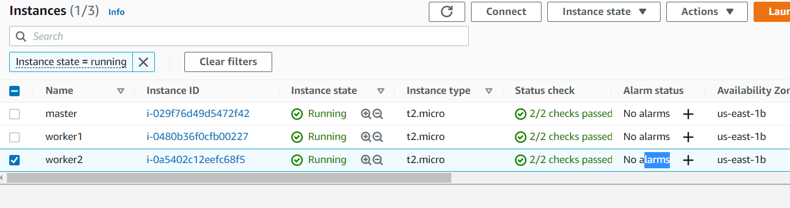
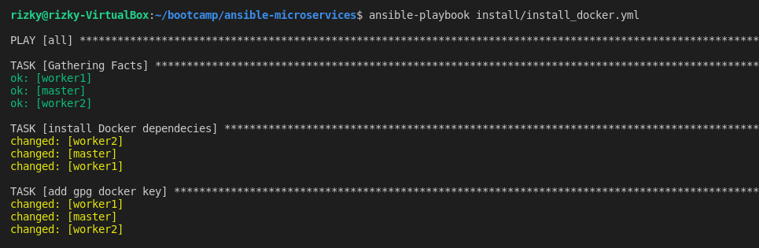
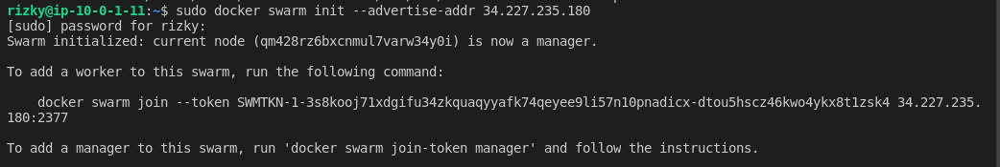
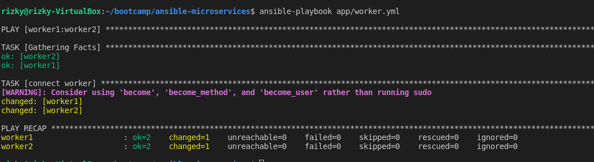
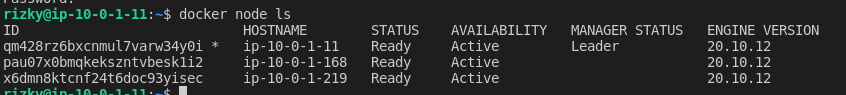
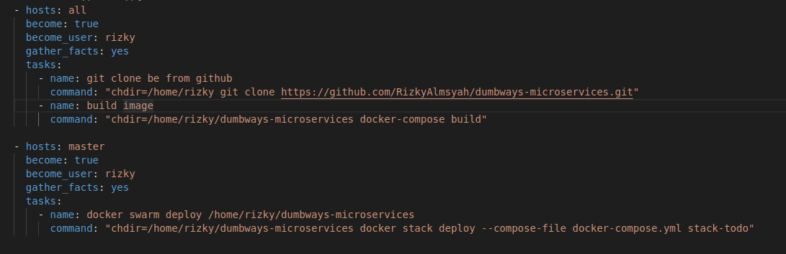
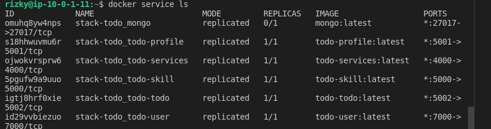
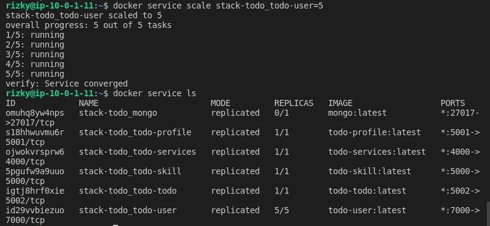
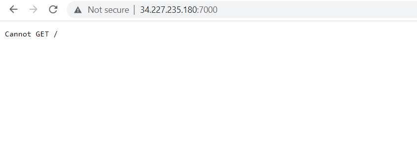

# Docker Swarm

1. Pertama buat 3 instance 1 untuk manager dan 2 untuk worker
     
   
    
2. Kemudian install docker pada tiap instance
    
   
    
3. Buat docker manager
    
   
    
4. Copy command yang keluar dari docker swarm init ke worker
    
   
    
5. Cek Docker swarm
    
   
    
6. Kemudian buat image pada docker kemudian jalankan todo app pada docker swarm
    
   
    
7. Hasilnya seperti berikut
    
   
    
8. Kemudian untuk menscale service
    
   
    
9.  Hasilnya seperti berikut
     
   
    