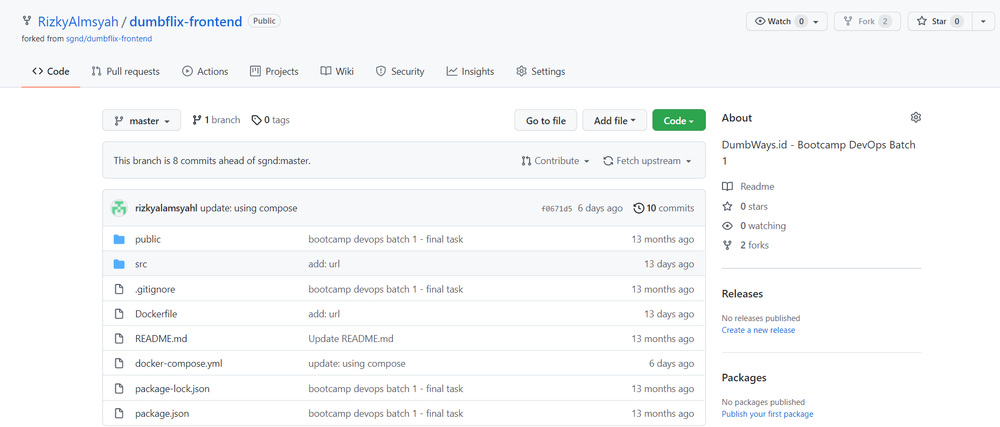
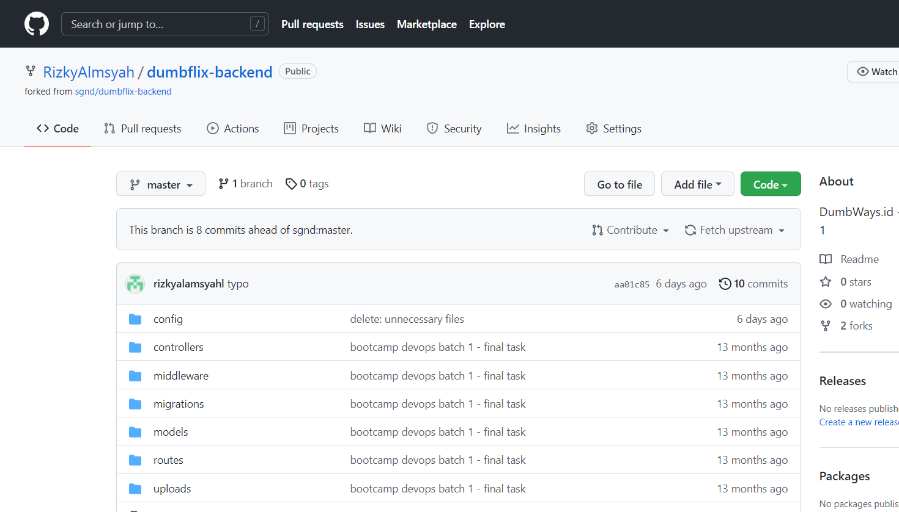
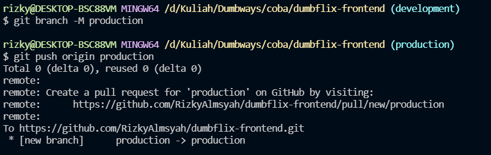
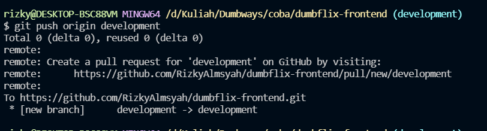
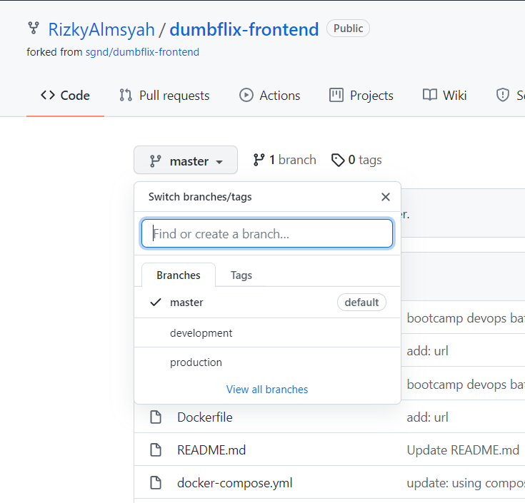
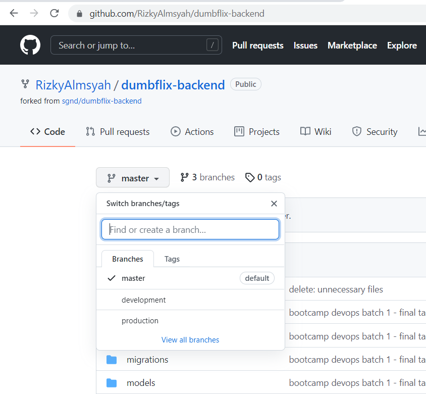

# Repository

1. Lakukan forking pada dumbflix frontend & Backend
    
   
    
    
   
    
2. buat branch baru Development dan Production pada repository
    
   
    
    
   
    
3. Hasilnya seperti berikut ini
    
   
    
    
   
    