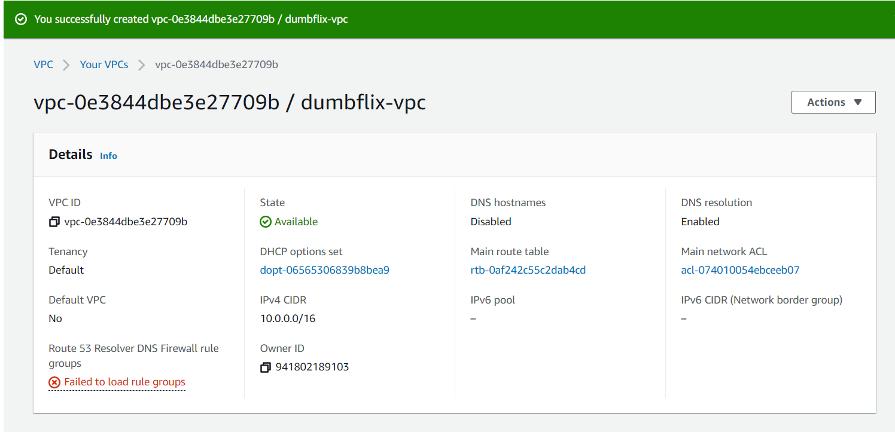
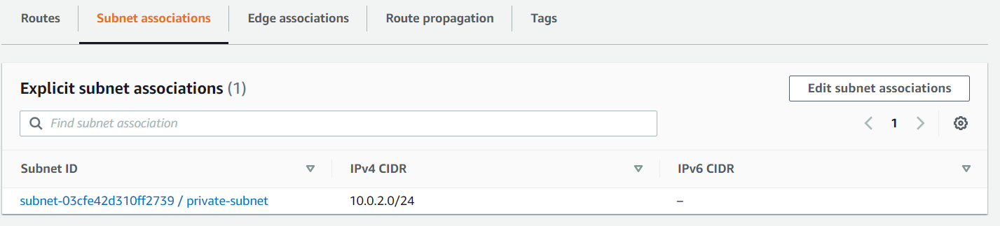

# Server

1. Pertama-tama buat vpc
    
   
    
    
   
    
2. Kemudian buat subnet
    
   
    
    
   
    
3. Kemudian buat internet gateway dan attach ke dumbflix-vpc
    
   
    
    
   
    
4. Kemudian buat nat gateway
    
   
    
5. Kemudian tambahkan route pada route table dumbflix
    
   
    
   dan tambahkan subnet public ke master
    
   
    
   
6. kemudian buat route table untuk private
    
   
    
7. tambahkan nat gateway pada route dan juga tambahkan subnet private
    
   
    
    
   
    
8. kemudian buat elastic ip untuk instance reverse-proxy
    
   
    
9.  Kemudian buat instance baru untuk masing2 server
     
   
    
    
   
    