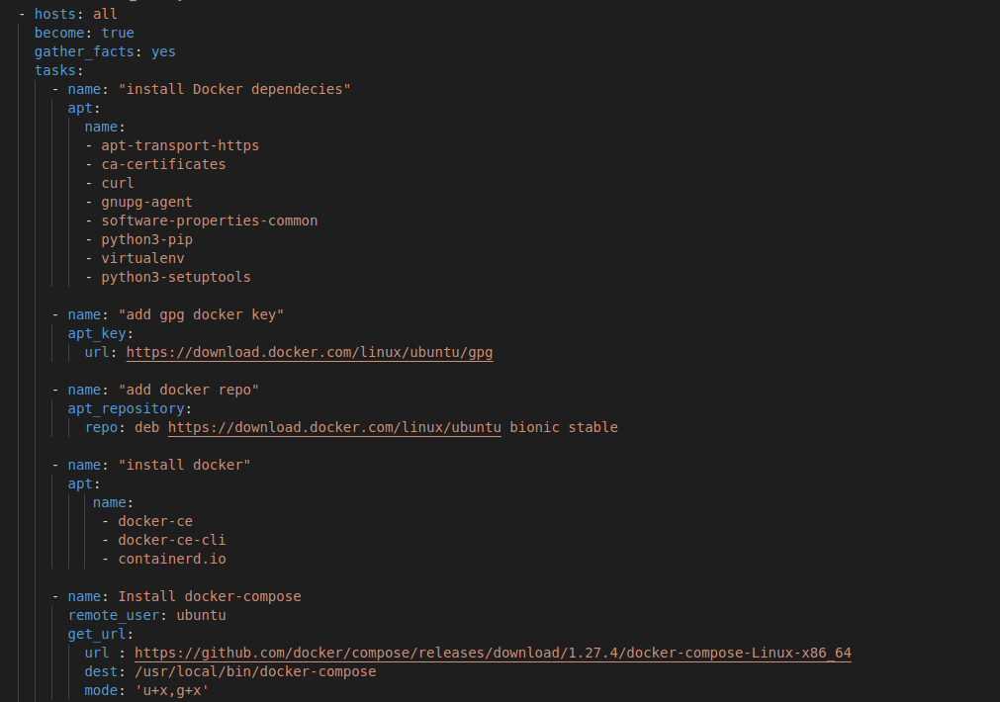

# Database

1. Sebelum kita install database, kita install docker terlebih dahulu
    
   
    
    
   
    
    
   
    
2. Kemudian buat db.yml untuk postgres
    
   
    
    
   
    
3. Hasilnya seperti ini
    
   
    