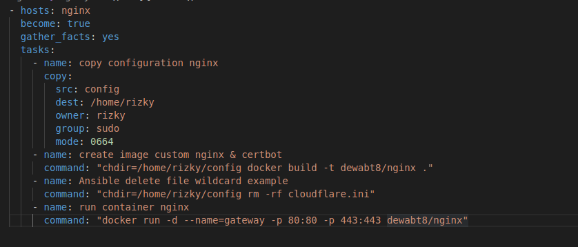
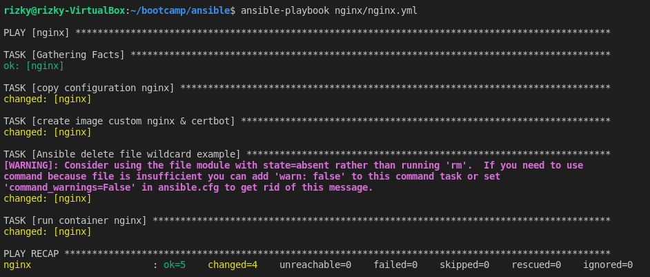
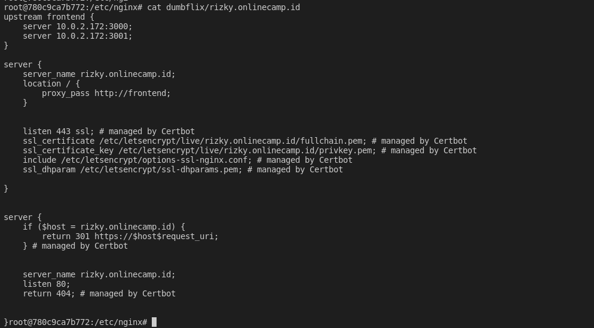
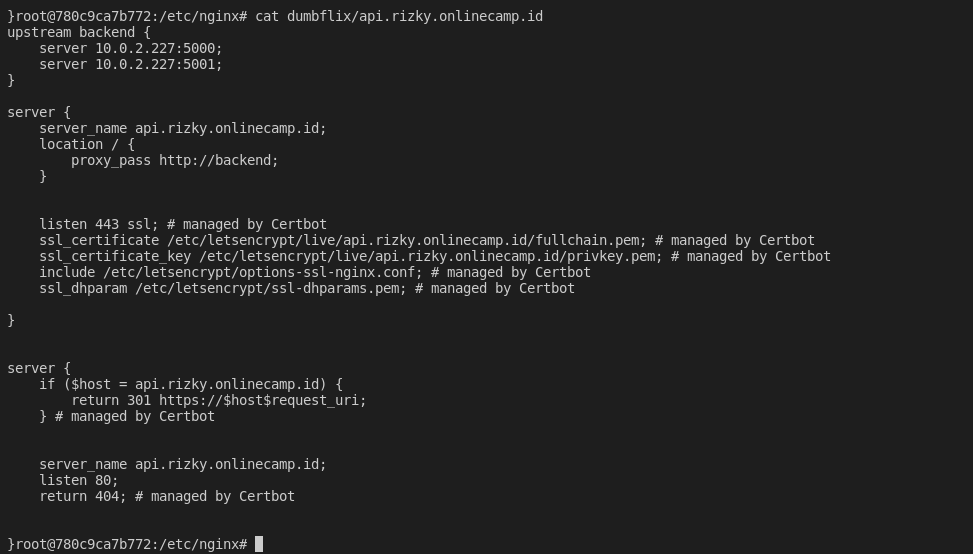
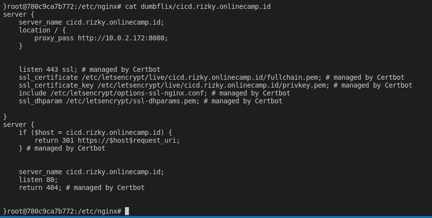
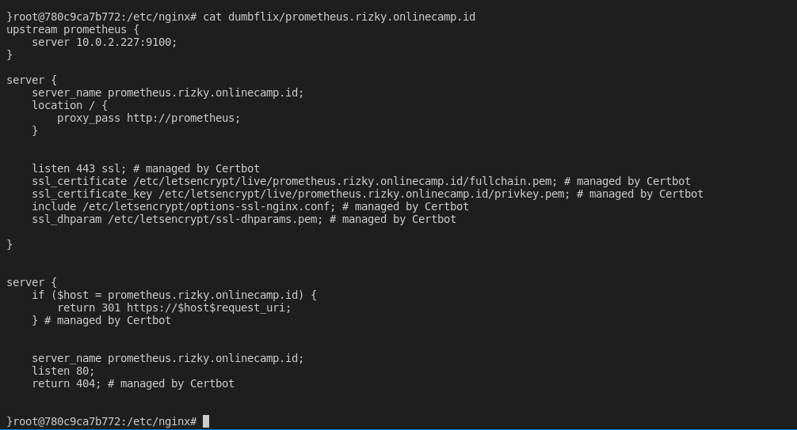
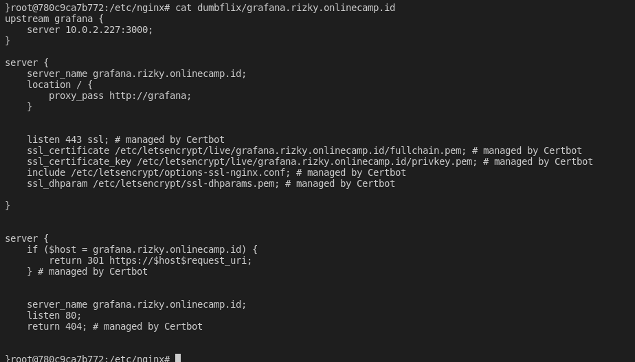

1. Jalankan ansible-playbook nginx-yml
    
   
    
    
   
    
2. Kemudian buat ssl untuk cicd, backend, frontend, grafana, dan prometheus
   
    
    
   
    
   
    
    
   
    
    
   
    