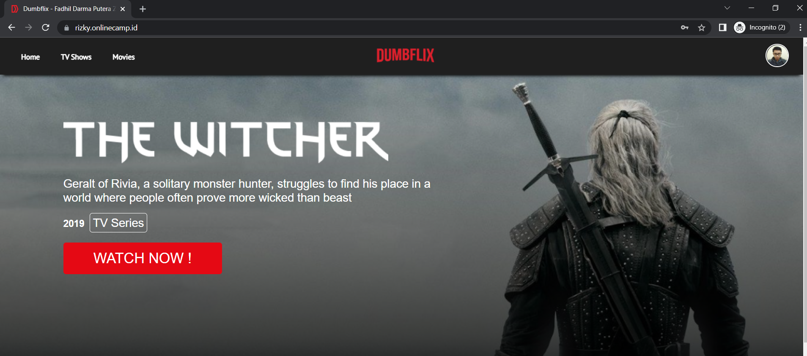

# Deployment

1. Buat Dockerfile backend dan frontend
    
   
    
    
   
    
2. kemudian buat docker-compose untuk frontend
    
   
    
3. Kemudian jalankan frontend dengan ansible-playbook
    
   
    
    
   
    
    
   
    
    
   
    
4. Kemudian jalankan backend dengan ansible-playbook
    
   
    
    
   
    
    
   
    
5. Hasilnya seperti ini
    
   
    