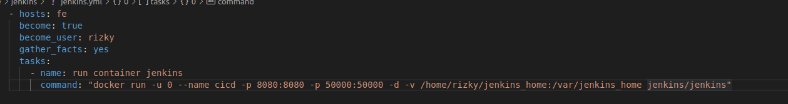
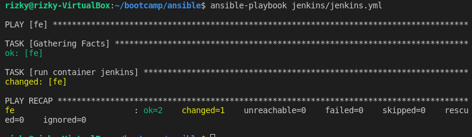
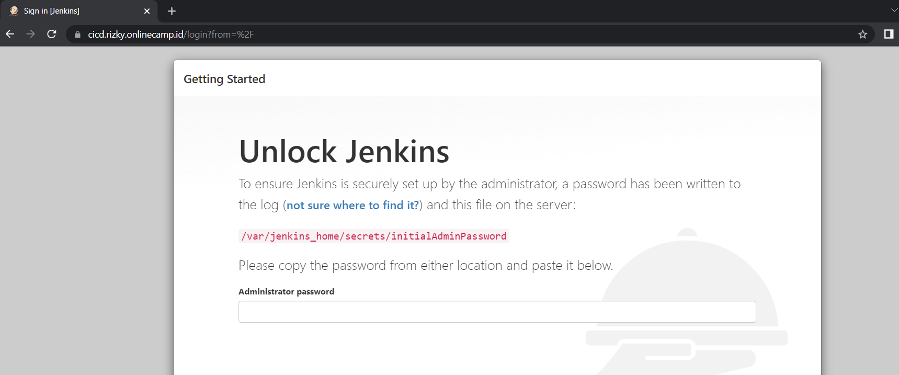
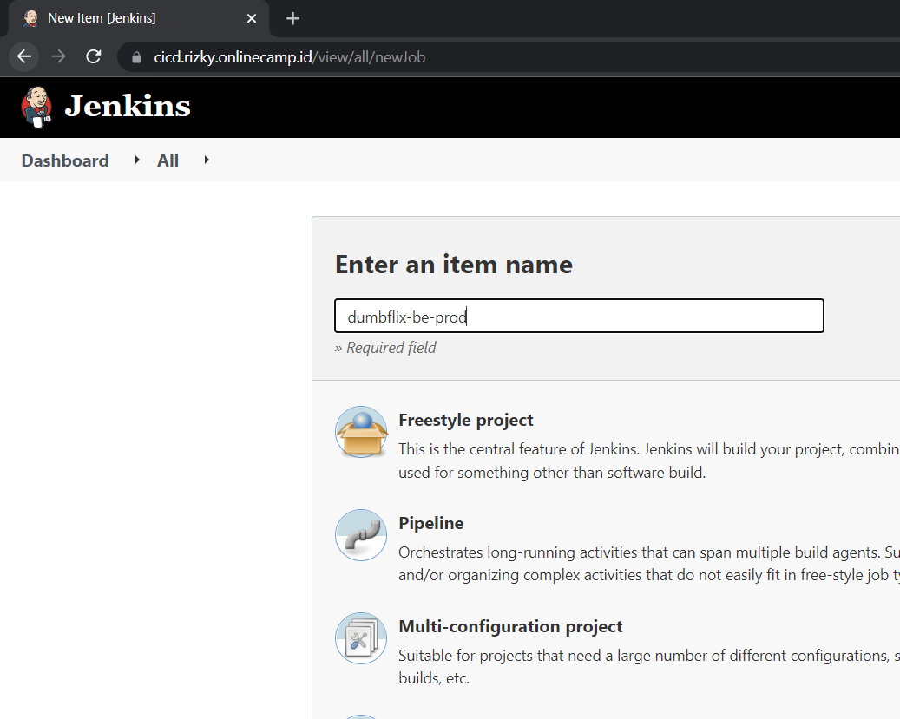
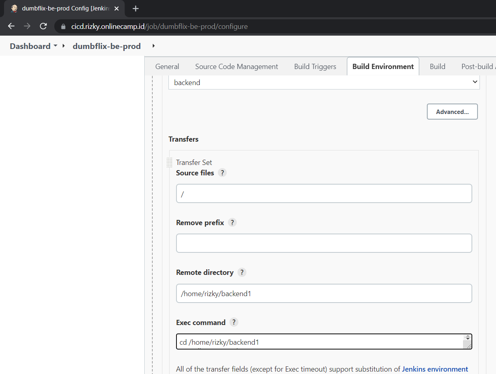
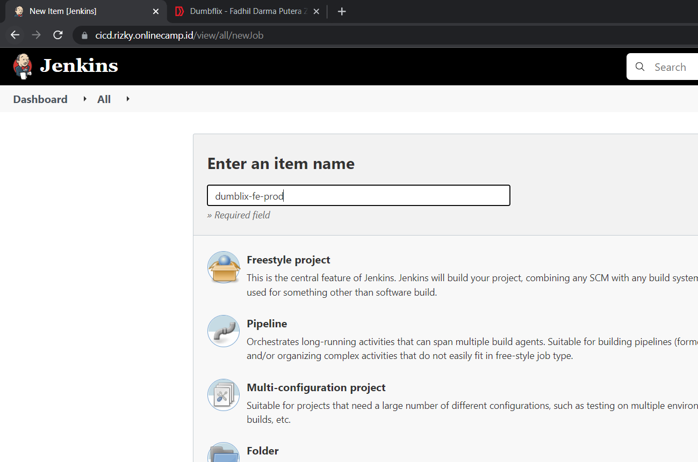
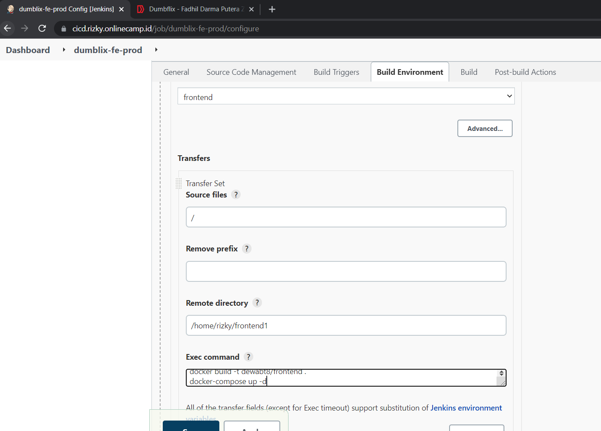
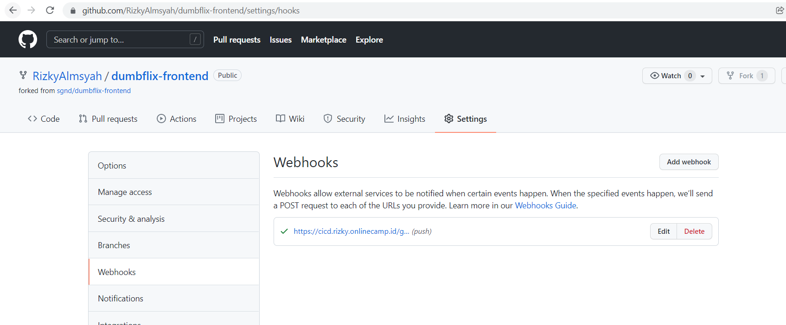
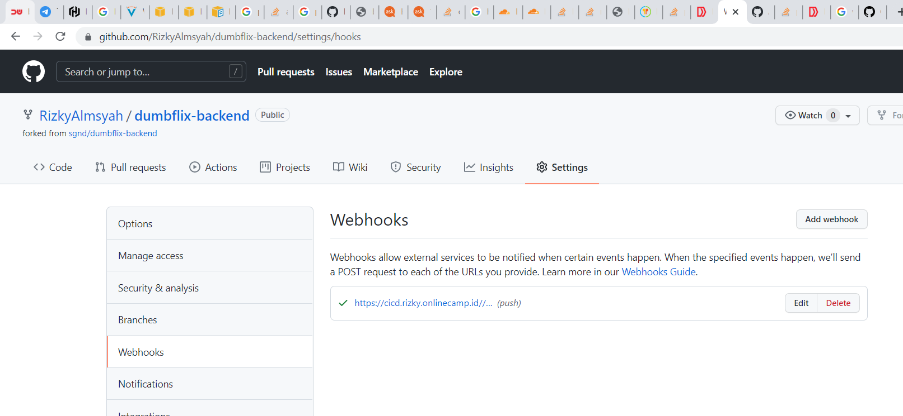

# CICD

1. Pertama-tama jalankan playbook cicd.yml
    
   
    
    
   
    
2. masuk ke `https://cicd.rizky.onlinecamp.id` dan masukkan password
    
   
    
3. Kemudian buat jobs untuk backend
    
   
    
    
   
    
4. Kemudian buat jobs untuk frontend
    
   
    
    
   
    
5. dan tambahkan webhooks
    
   
    
    
   
    