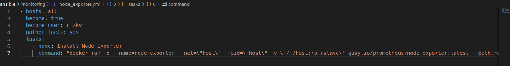
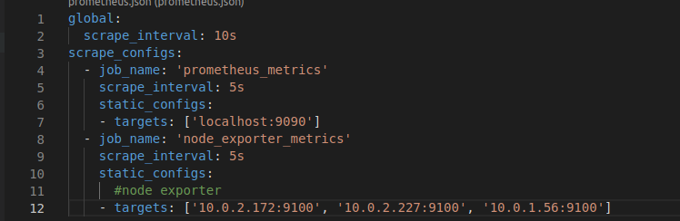
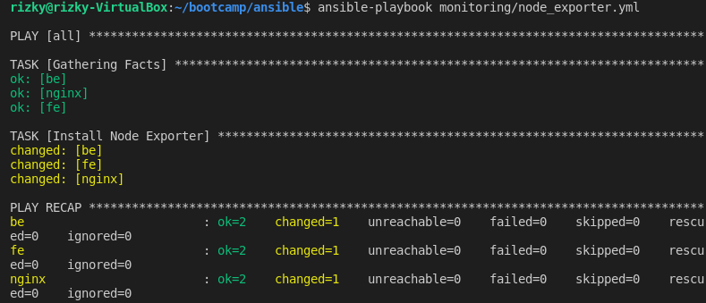
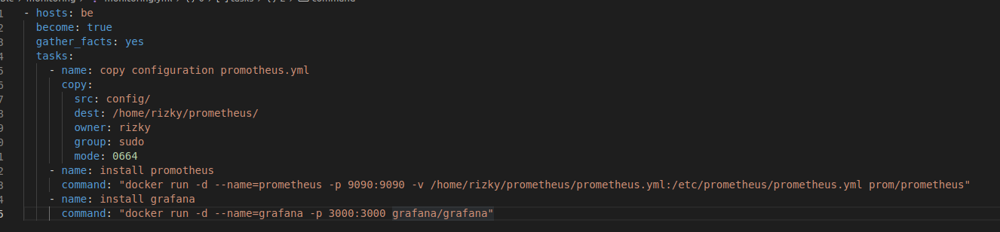
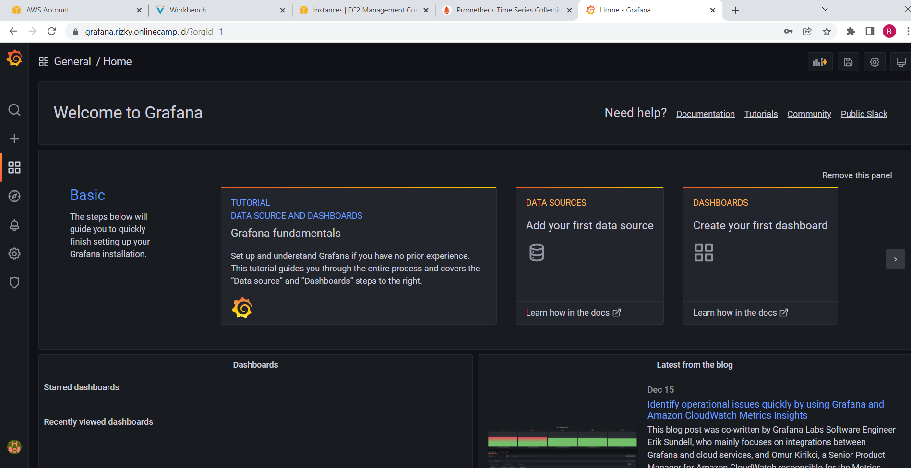
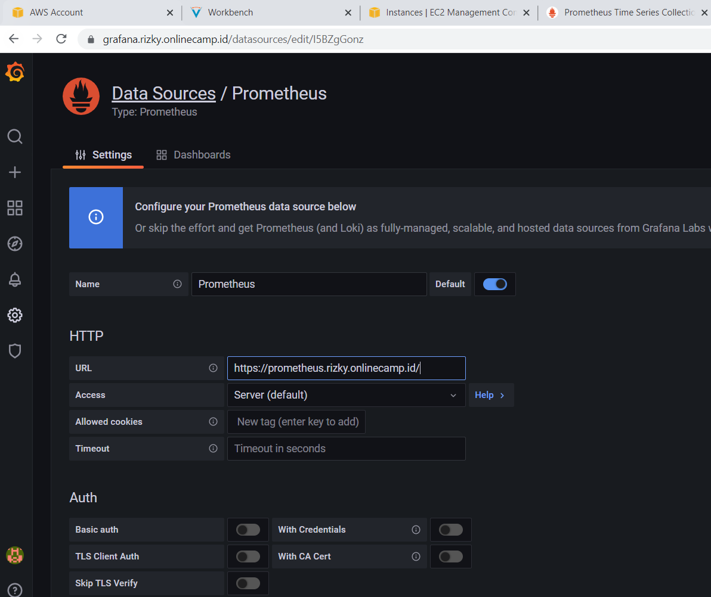
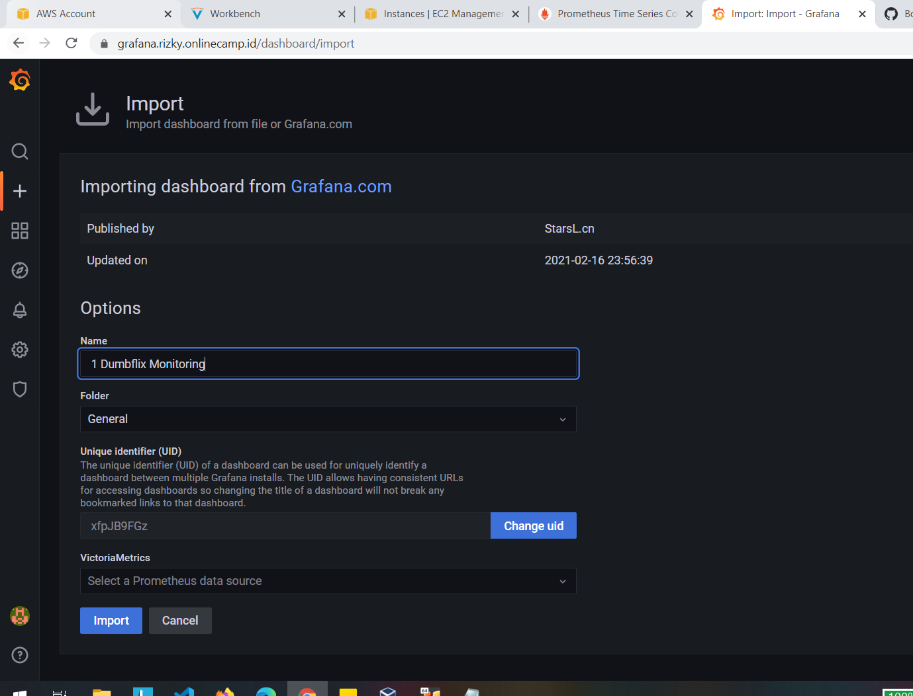
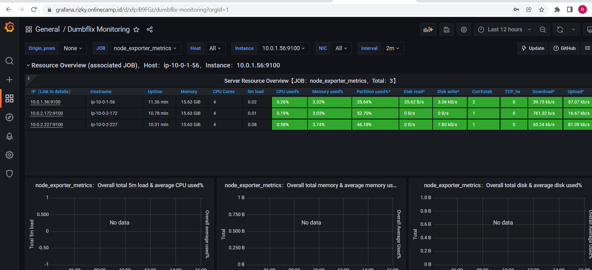

# Monitoring

1. jalankan node exporter dengan ansible-playbook
    
   
    
    
   
    
    
   
    
2. kemudian jalankan prometheus dan grafana dengan ansible-playbook
    
   
    
    
   
    
3. kemudian masuk ke grafana
    
   
    
4. tambahkan data source
    
   
    
5. kemudian buat dashboard
    
   
    
6. hasilnya seperti berikut ini
    
   
    