# Create and Setup Server

        arsitektur yang saya gunakkan di aws

 
   
    

1. Login terlebih dahulu ke aws `https://aws.amazon.com/id/education/awseducate/`
2. Kemudian cari vpc di service kemudian create vpc
    
   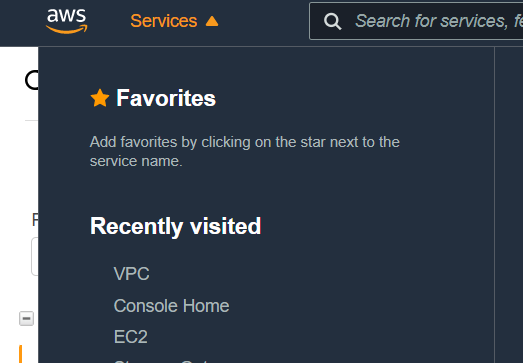
    
   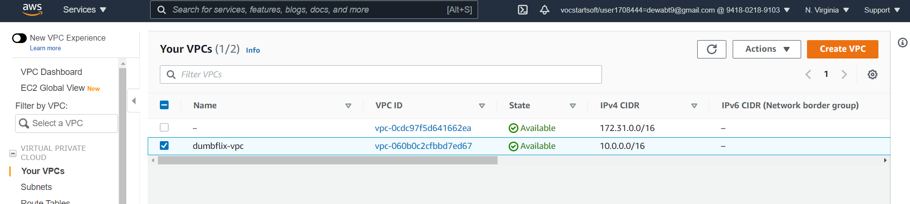
    
3. Kemudian beri nama dan isi Ipv4 CIDR block nya
    
   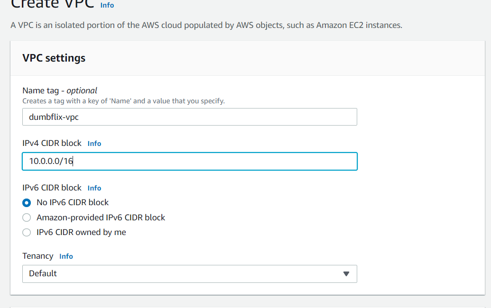
    
4. Kemudian tambahkana subnet untuk public subnet 10.0.1.0/24 & untuk private subnet 10.0.2.0
    
   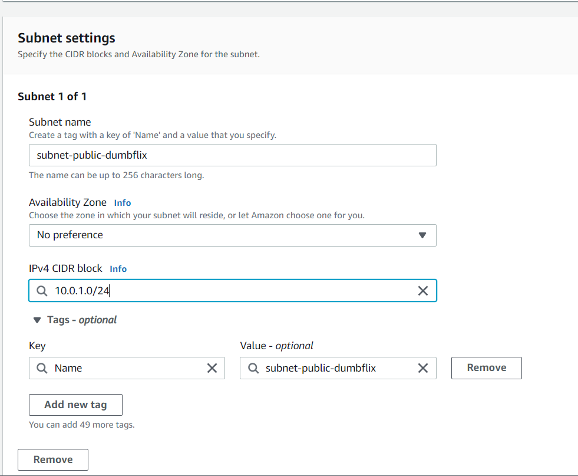
    
5. Kemudian buat internet gateway dan attach ke dumbflix-vpc
    
   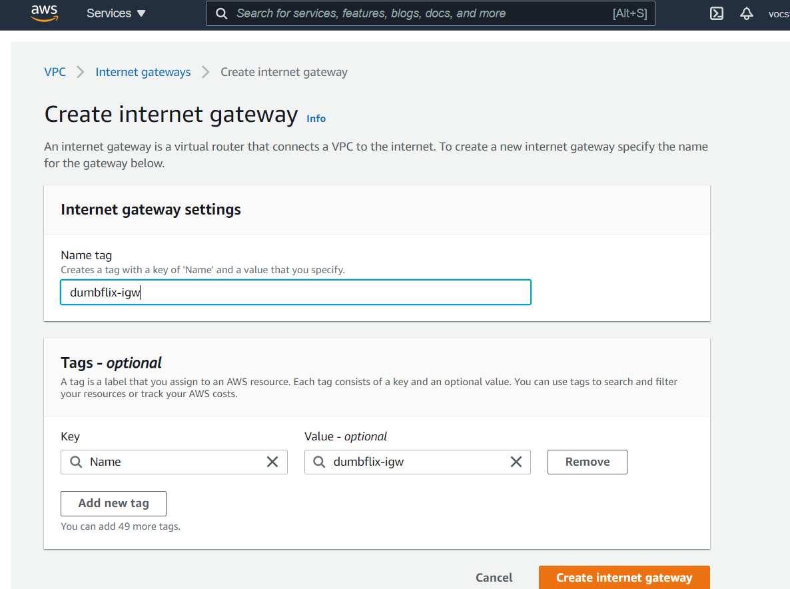
    
    
   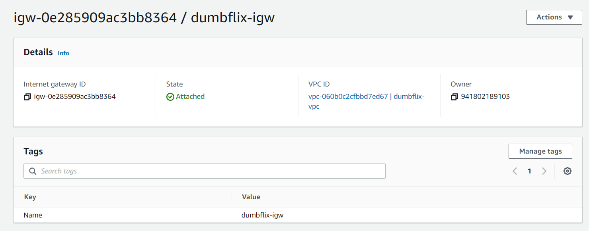
    
6. sekarang buat tambahkan igw di route table ke public route dan tambahkan public subnet ke main route table
    
   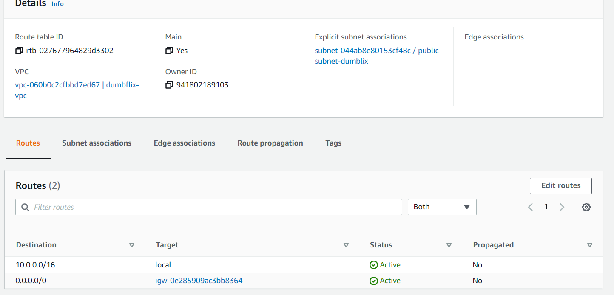
    
    
   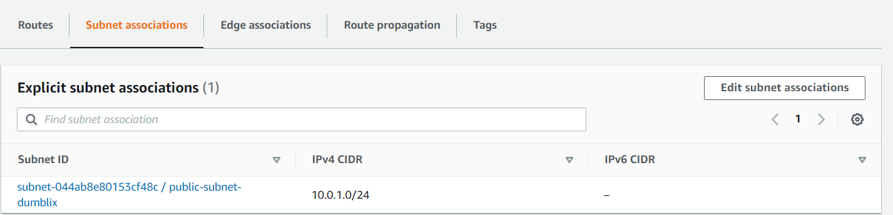
    
7. sekarang buat 2 elastic ip yang satu untuk reverse proxy dan yang satu untuk nat gateway
    
   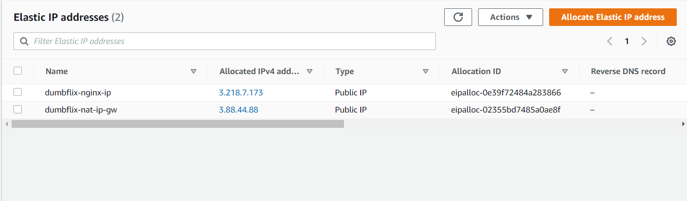
    
8. Kemudian buat nat gateway
    
   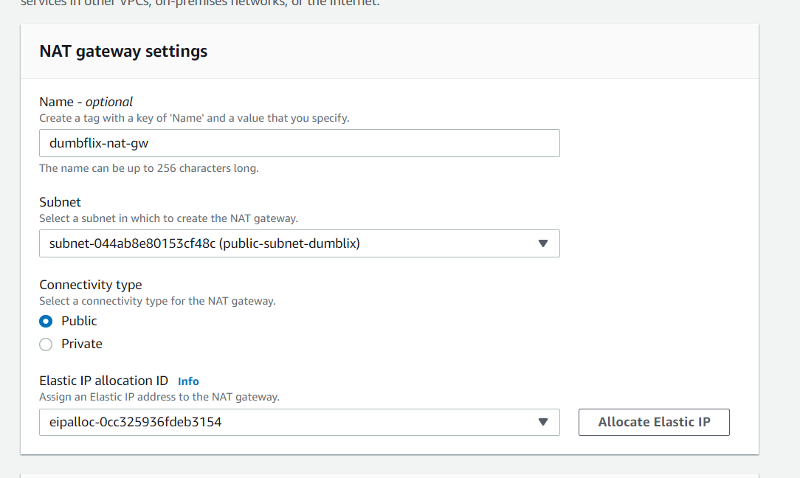
    
    
   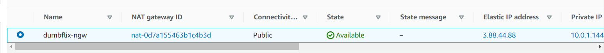
    
9.  Kemudian buat private route table dan tambahkan nat gw pada route
     
   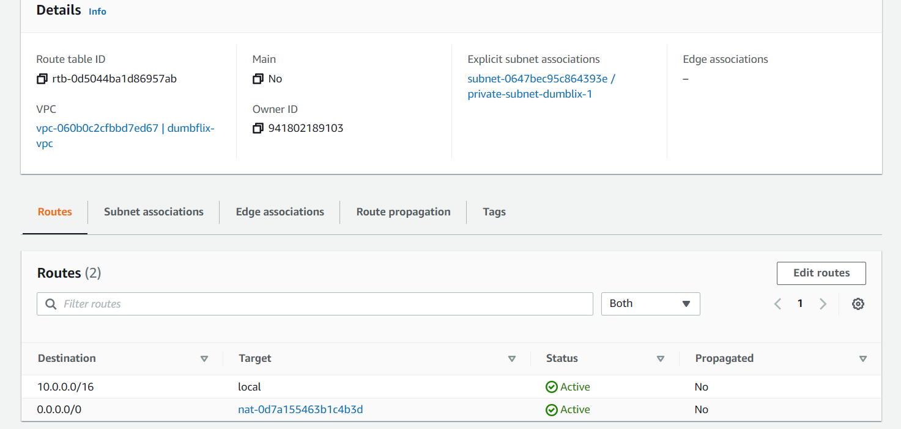
    
10. Kemudian buat ec2 untuk reverse proxy dengan klik launch instance
     
   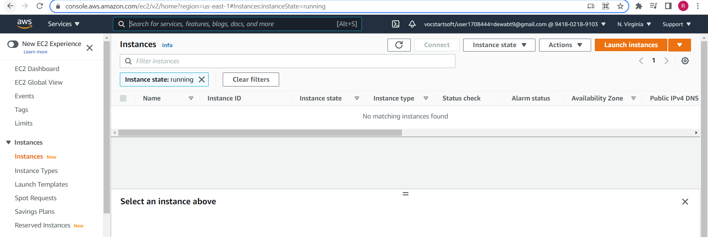
    
11. Kemudian cari ubuntu kemudian klik select
     
   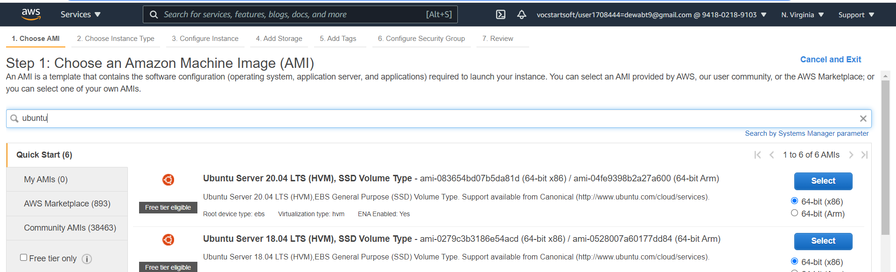
    
12. pilih instance type 
     
   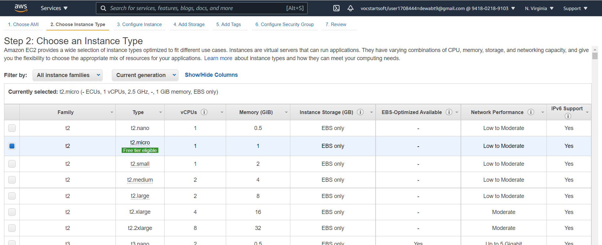
    
13. Lalu lakukan configurasi 
     
   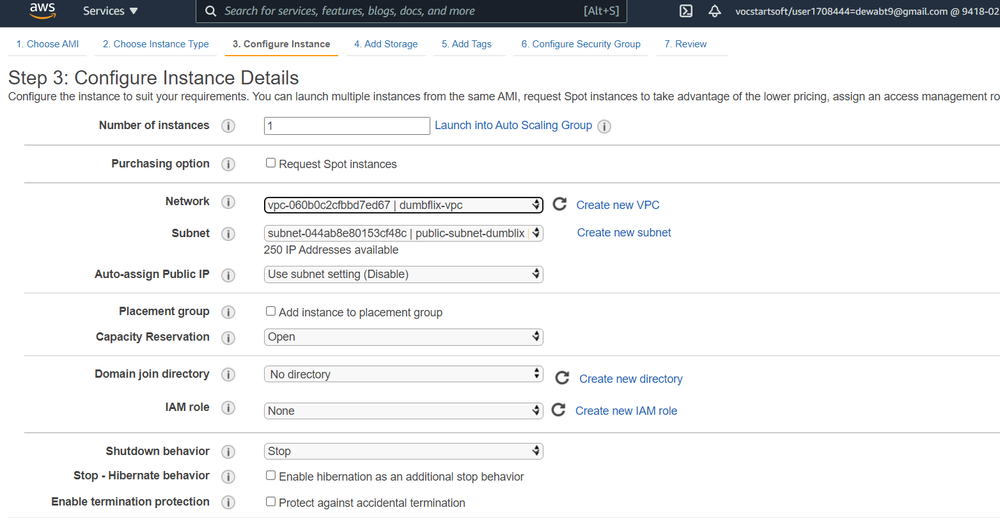
    
14. Lalu disecurity group untuk `reverse proxy`
     
   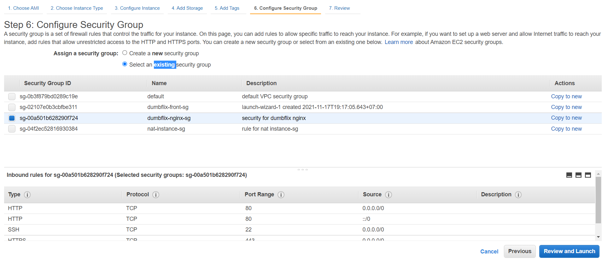
    
15. Lalu klik review, jika sudah selesai klik finish
     
   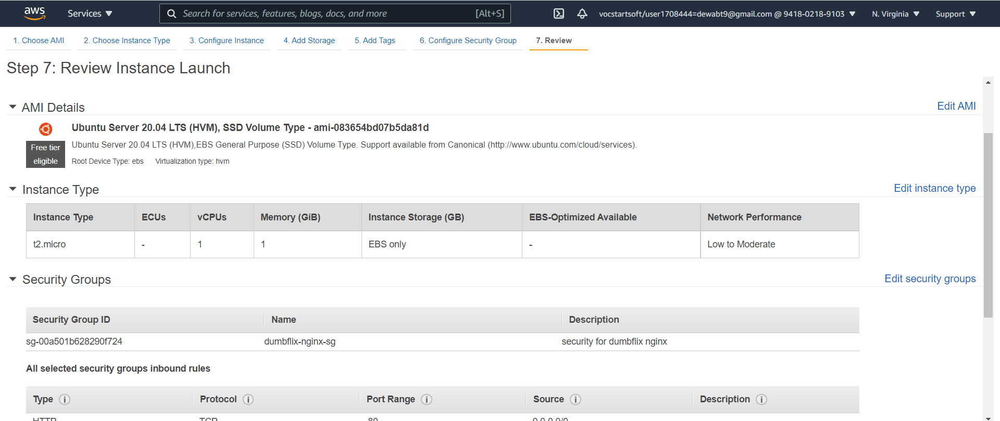
    
16. Ketika kita menekan select maka akan muncul pop up untuk membuat atau memilih key pair yang sudah ada
     
   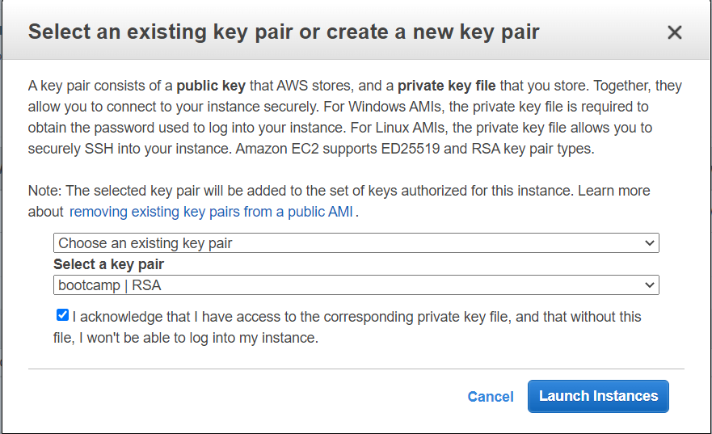
    
17. Kemudian kita masukkan ip public dengan elastic ip yang kita buat tadi ke reverse proxy
     
   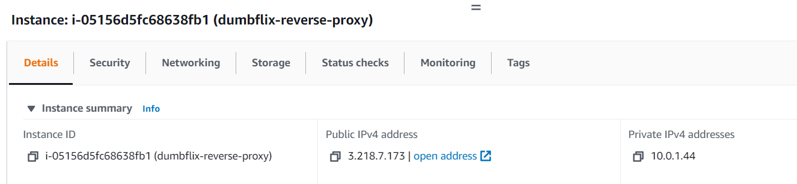
    
18. Kemudian kita buat ec2 instance untuk front end sama seperti membuat reverse proxy yang membedakan pada konfigurasi dan security group
     
   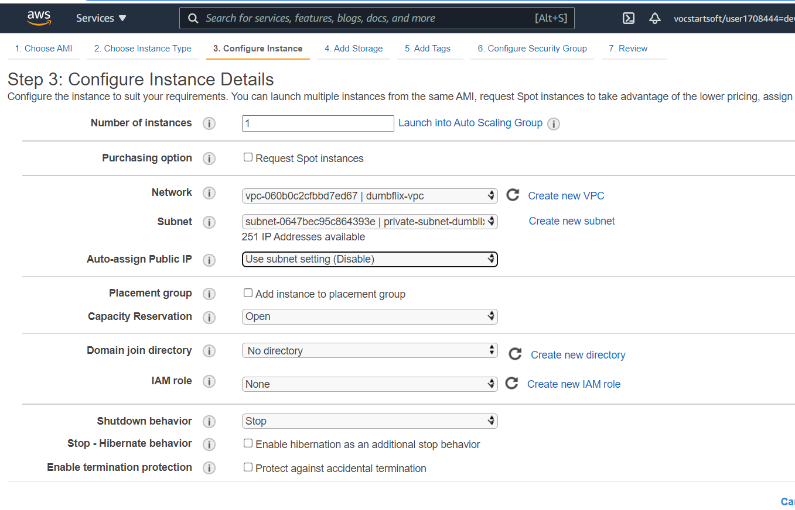
    
    
   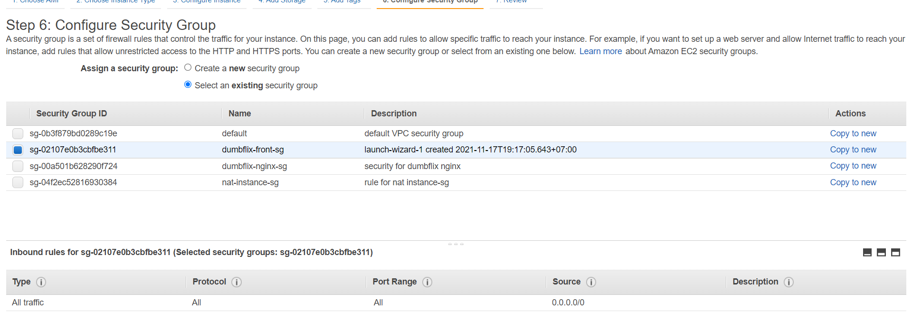
    
    
   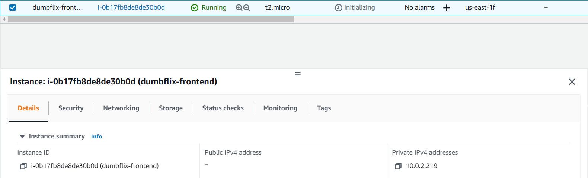
    