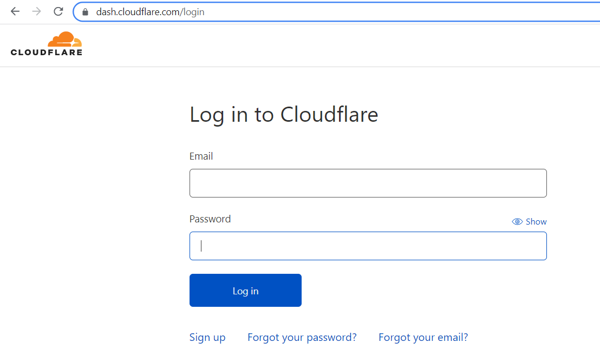
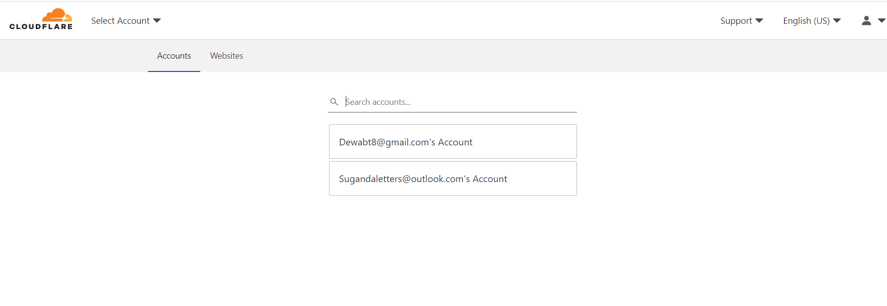
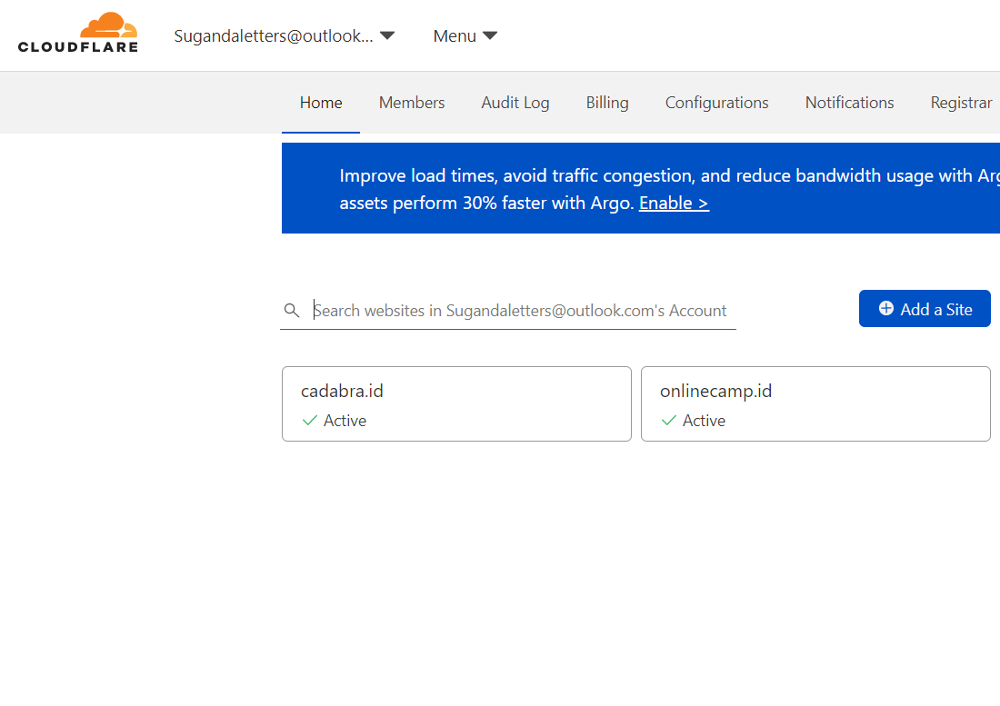
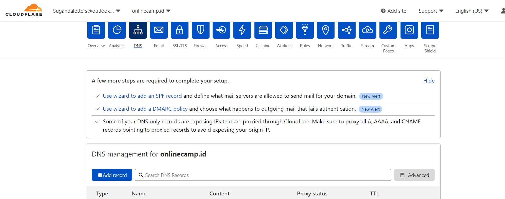
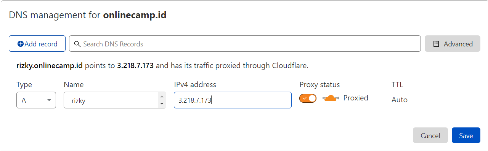
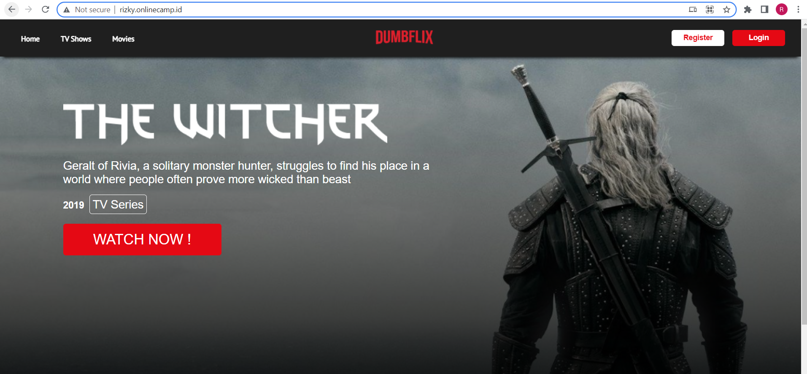

# Custom Domain

1. Login ke cloudflae
    
   
    
   
2. Lalu disini klik email yang ingin di pakai, disini saya memakai email dari `Sugandaletters@outlook.com` Acount
    
   
    
   
3. Lalu pilih atau klik yang `onlinecamp.id`
    
   
    
4. Klik dns dan tambahkan add record 
    
   
    
    
   
    
5. Tunggu sebentar dan kita bisa akses `rizky.onlinecamp.id`
    
   
    