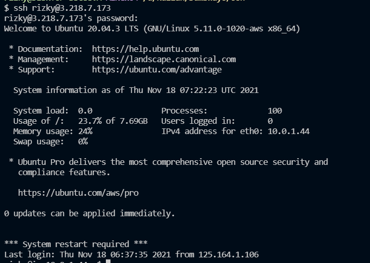

# Reverse Proxy

1. akses ke server melalui ssh `ssh rizky@3.218.7.173`
    
   
    
2. karena sudah diupdate dan upgrade maka selanjutnya install nginx
    
   
    
3. Kemudian cek status nginx
    
   
    
4. Kemudian buat file frontend pada `etc/nginx/` dan rubah kepimilikan
    
   
    
5. kemudian buat file pada direktroi frontend `rizky.onlinecamp.id` dan tambahkan folde yang dinclude pada `etc/nginx/nginx_conf
    
   
    
    
   
    
6. kemudian cek konfigurasi apakah berhasil dan juga reload
    
   
    
7. kemudian kita cek apakah berhasil
    
   
    