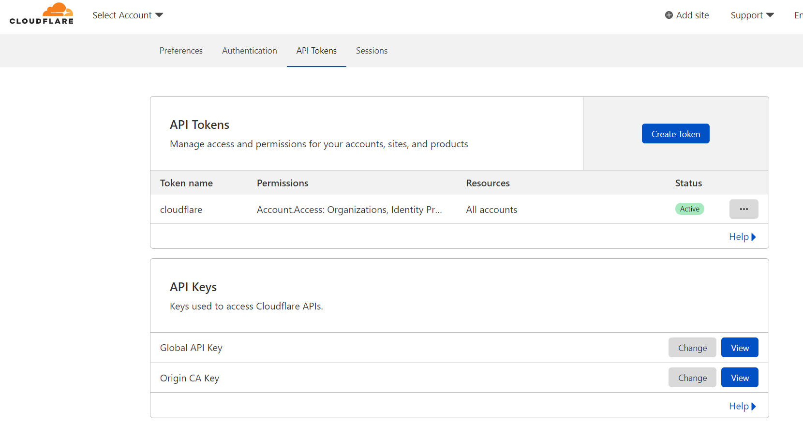
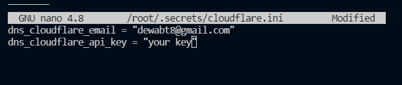
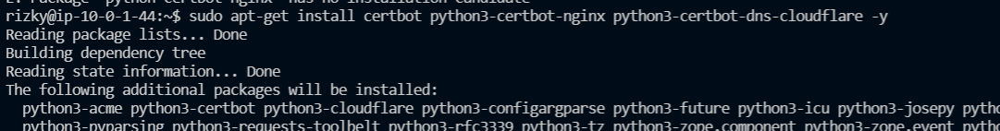
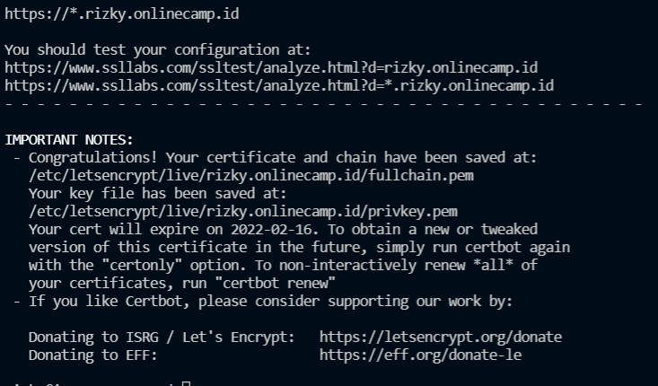

# SSL Configuration

1. pertama-tama buka cloudflare dan buka api key di profile
    
   
    
2. kemudian buat file pada `/root/.secrets/cloudflare.ini`
    
   
    
3. kemudian lakukan langkah2 berikut ini
   
        $ sudo apt-get install certbot python3-certbot-nginx python3-certbot-dns-cloudflare
     
   
    
4. kemudian tambahkan perintah ini
        
        $ sudo certbot --dns-cloudflare --dns-cloudflare-credentials /root/.secrets/cloudflare.ini -d rizky.onlinecamp.id, --preferred-challenges dns-01 -i nginx
   
    
   
    

5. hasilnya seperti berikut
    
   
    
   
   
   
   

