# Server For Application

Karena saya windows langsung saja

1. masuk ke server dengan perintah `ssh -i bootcamp.pem ubuntu@3.128.7.173`
    
   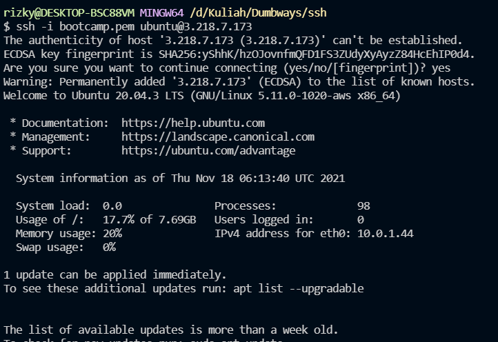
    
2. lakukan update & upgrade server
    
   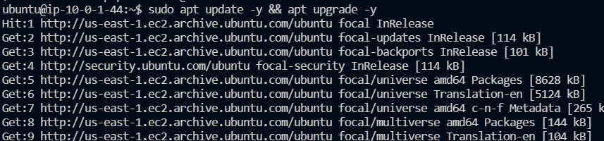
    
3. Kemudian buat user dan beri hak akses sudo
    
   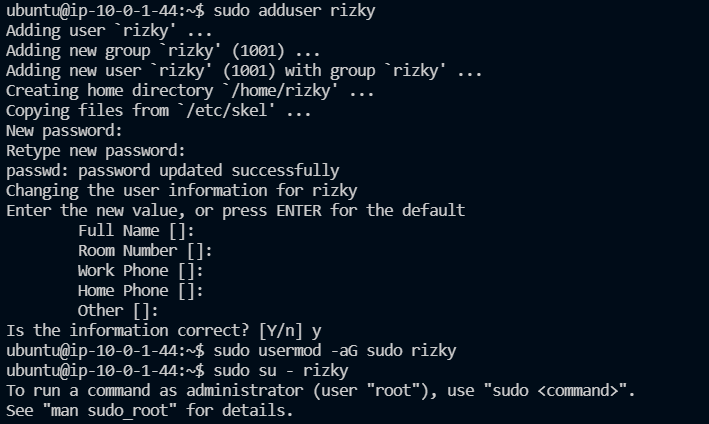
    
4. Kemudian edit config ssh `etc/ssh/sshd_config` kemudian reload ssh
    
   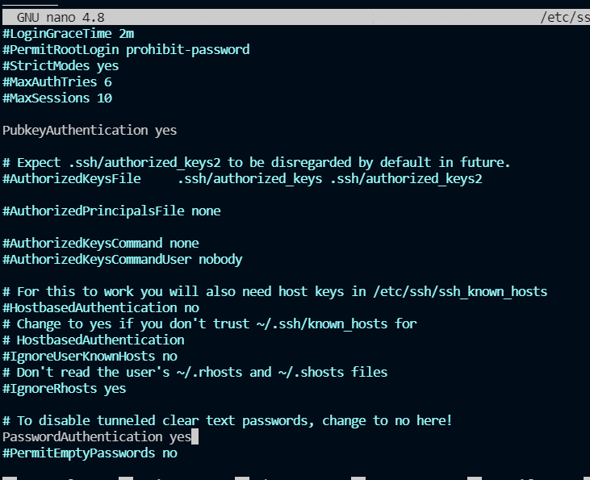
    
5. untuk masuk ke frontend kita melewati reverse proxy
    
   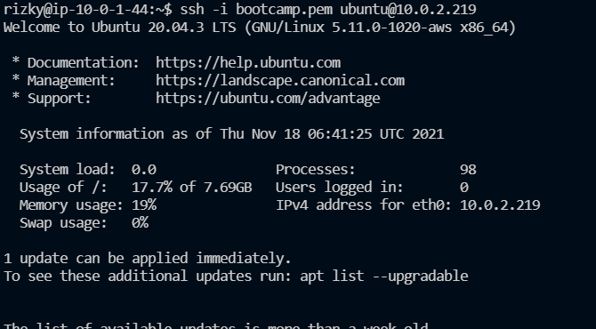
    
6. Sama seperti direverse proxy kita update buat user dan konfigurasi ssh
    
   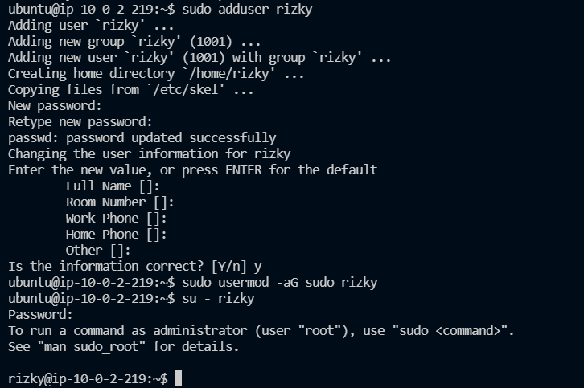
    
    
   
    
7. Kita install nvm dan cek versinya
    
   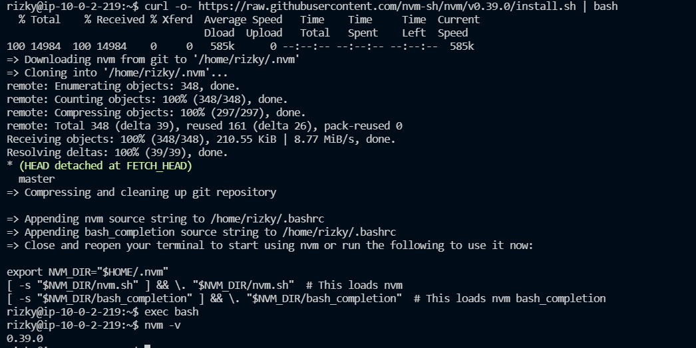
    
8. Kemudian install node 10
    
   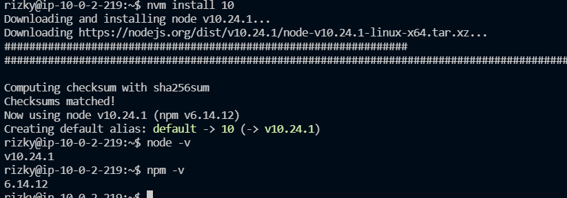
    
9.  Kemudian clone repository
     
   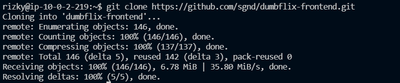
    
10. ubah nama `dumbflix-frontend` menjadi `frontend`
     
   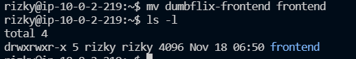
    
11. lalu install dependecies yang diperlukan
     
   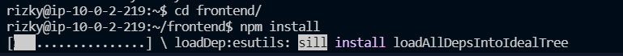
    
12. Kemudian kita install pm2
     
   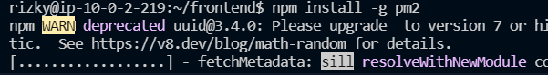
    
13. Kemudian jalankan dengan perintah `pm2 start ecosystem.config.js`
     
   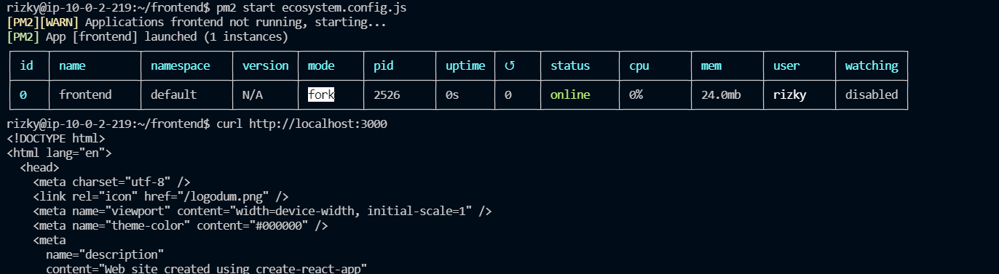
    