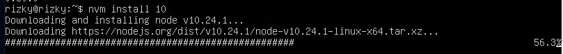
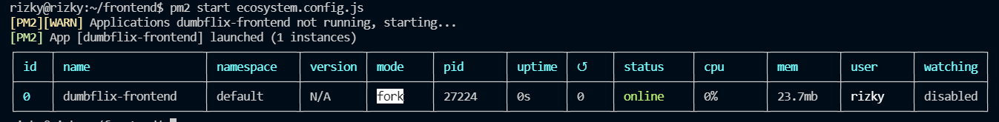

# APPLICATION AND DEPLOY

1. Pertama update dan upgrade dulu ubuntu server
        
        sudo apt update -y && sudo upgrade -y

     
   
    
2. Kemudian lakukan install nodejs dan npm dengan perintah berikut :
   
    
   
    

3. Kemudian cek versi
     
   
    

4. Install version nodejs 10, dengan perintah sebagai berikut :
    
   
    

5. lalu lakukan clone repository frontend-dumbplay dengan perintah tersebut :
   
    
   
    

6. Kemudian rename folder dari `dumbplay-frontend` menjadi `frontend`
   
    
   
    

7. Kemudian masuk ke direktori `frontend` dan ketik perintah `npm install`
    
   
    
8. Kemudian install pm2 
       
   
    

9.  Kemudian generate ecosystem dengan menggunakkan perintah `pm2 init simple`
     
   
    

10. kemudian edit `ecosystem.config.js`
     
   
    

11. Kemudian jalankan `pm2 start ecosystem.config.js`
     
   
    
12. Hasilnya seperti berikut
     
   
    
13. Kemudian install nginx
     
   
    
14. Kemudian tambahkan buat folder pada /etc/nginx
     
   
    
15. Kemudian tambahkan pada /etc/nginx/nginx.conf dan setelah itu ketik perintah `sudo nginx -t` dan `sudo systemctl reload nginx`
     
   
    

16. Kemudian buat konfigurasi
     
   
    
17. Dan hasilnya seperti ini
      
   
    