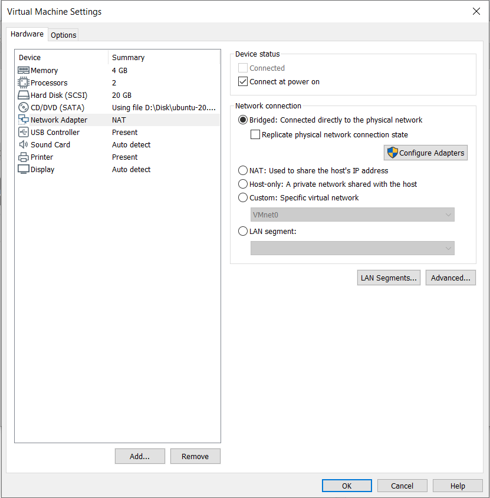
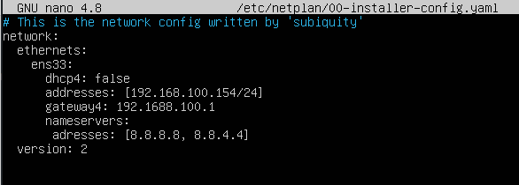
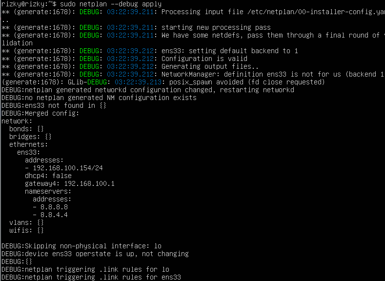
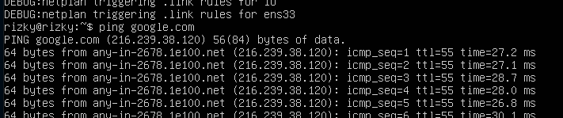

# Setup Network

1. Saat setup customize hardware pilih network connection dengan Bridged
    
   
    

2. Kemudian masuk ubuntu server kemudian edit `sudo nano /etc/netplan/00-installer-config.yaml`
    
   
    
   
3. kemudian ketikkan perintah
   
         sudo netplan --debug apply
    
   
    
   
4. kemudian kita coba ping google
    
   
    
   