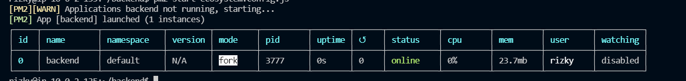

# Deployment Backend

1. Kita buat ec2 di private ip
2. lalu ubah folder menjadi backend
    
   
    
   
3. Kemudian kita rubah konfigurasi `/backend/config/config.json
    
   
    
   
4. install sequelize untuk mengelola database yang kita miliki.
    
   
    
5. Lakukan migrate, agar database yang didalam aplikasi ter migrate kedalam sebuah database
    
   
    
6. cek apakah sudah berhasil termigrasi
    
   
    
7. Lalu copy ubah .env-copy menjadi .env
    
   
    
8. untuk dapat melakukan crud pada aplikasi online, kita pergi ke aplikasi frontennd dan masuk ke dalam file dan folder berikut.
    
   
    
9.  Kemudian jalankan pm2 untuk backend
     
   
    