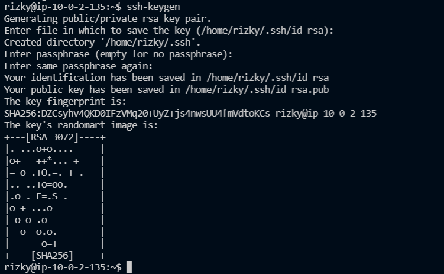
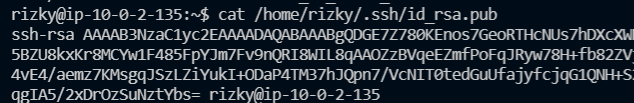
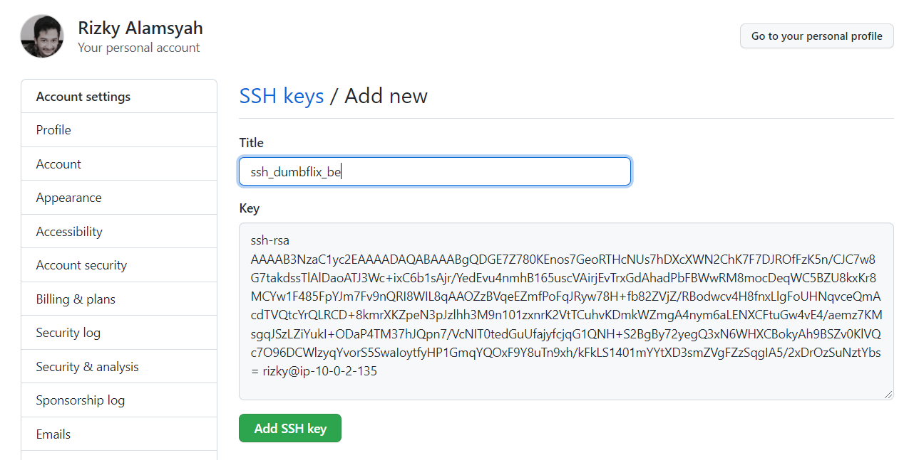
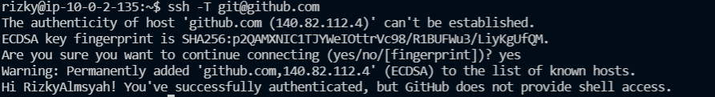
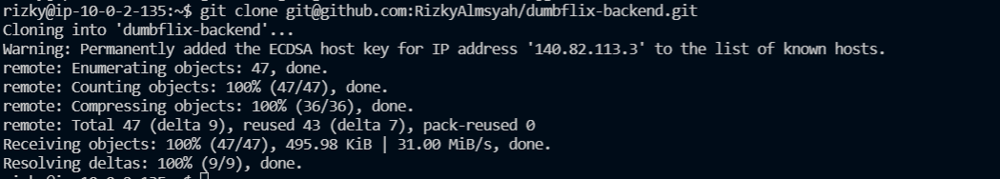
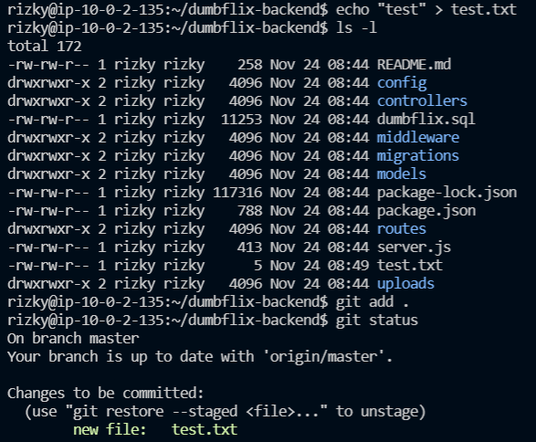
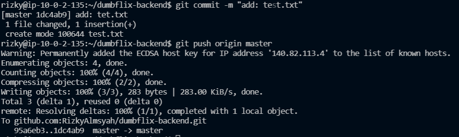
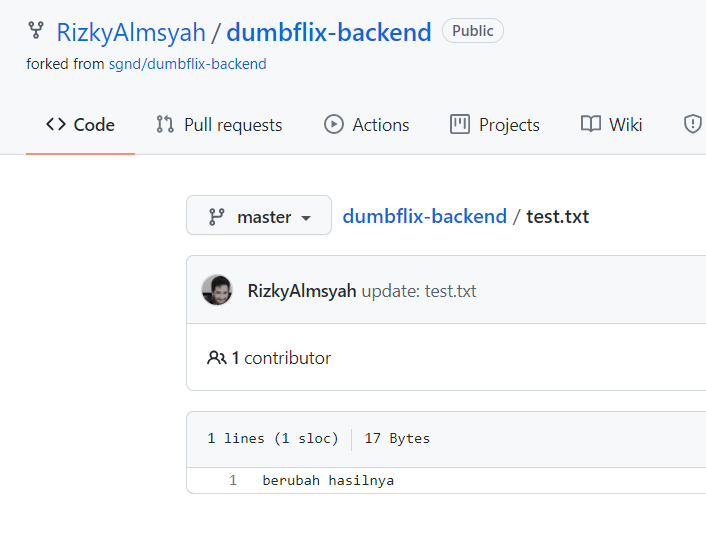
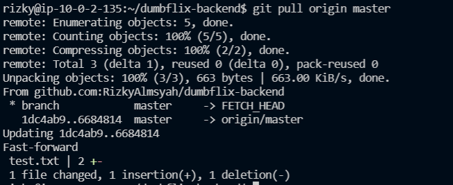

# Install Git and SSH Key
1. Pertama-tama `sudo apt update -y && sudo apt upgrade -y`
2. Karena biasanya git sudah terinstall maka cara mengeceknya menggunakkan git --version
     
   
    
3. Membuat sebuah ssh, untuk dapat melakukan push ke dalam github tanpa melakukan login terlebih dahulu yaitu dengan mengetikan perintah `ssh-keygen`.
    
   
    
4. Setelah membuat sebuah ssh, kita harus melakukan pemindahan atau copy paste kunci pub ssh kedalam github
    
   
    
    
   
    
5. Kemudian kita dapat menggunakan ssh dengan mengetikkan perintah `ssh -T git@github.com`
    
   
    
6. lalu kita lakukan git clone dengan menggunakan link yang sudah di fork, dengan perintah
    
   
    
 

# GIT ADD, GIT COMMIT, GIT PUSH, GIT PULL

1. Disini saya akan memindahkan file ke github dengan nama test.txt
    
   
    
    
   
    
    
   
    
2. Disini saya akan mengepull repository ketika ada perubahan pada github
    
   
    
    
   
    
   