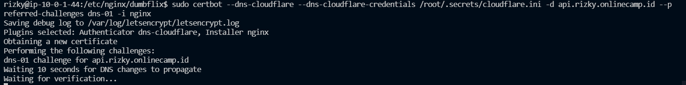
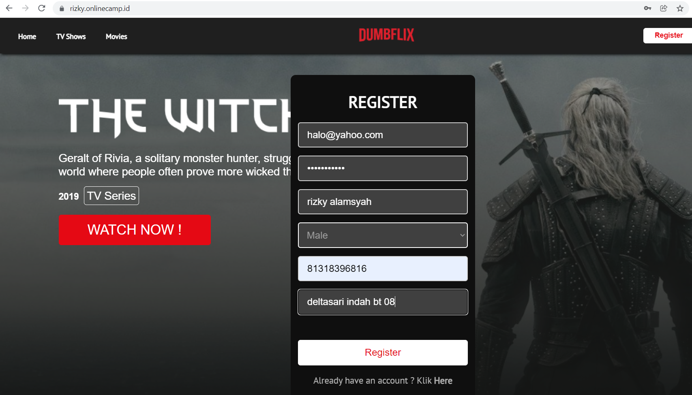
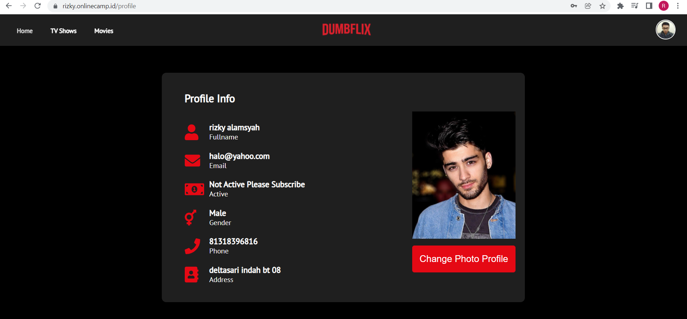

# SSL CONFIGURATION
   
1.  tambahkan perintah berikut ini
   
        $ sudo certbot --dns-cloudflare --dns-cloudflare-credentials /root/.secrets/cloudflare.ini -d api.rizky.onlinecamp.id, --preferred-challenges dns-01 -i nginx

     
   
    
2.  hasilnya seperti berikut ini
    
   
    
    
   
    