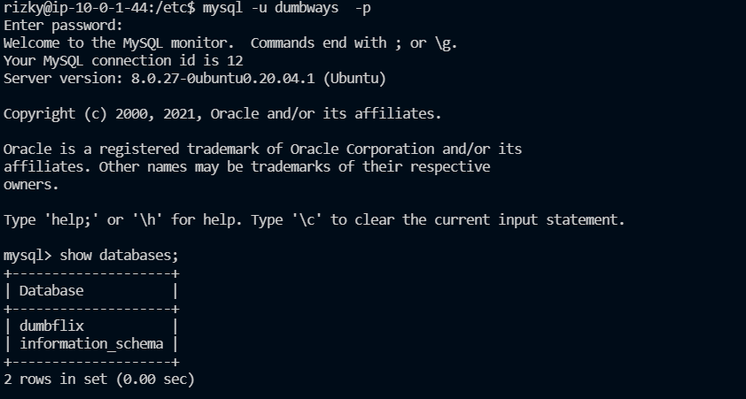

# Setup Database Server

1. Lakukan update & upgrade dulu
2. Kemudian install mysql
     
   
    
   
3. Kemudian ketik perintah `sudo mysql_secure_installation` dan lakukan konfigurasi berikut
    
   
    
    
   
    
    
   
    
4. Kemudian buat konfigurasi mysql agar tidak menggunakkan sudo
    
   
    
    
   
    
    
   
    
5. Lalu agar mysql dapat di akses oleh luar server masuk kedalam file dan folder berikut.
    
   
    
6. Kmudian lakukan create User dengan perintah berikut agar dapat diakses oleh backend dan buat database dumbflix.
     
   
    
    
   
    
   