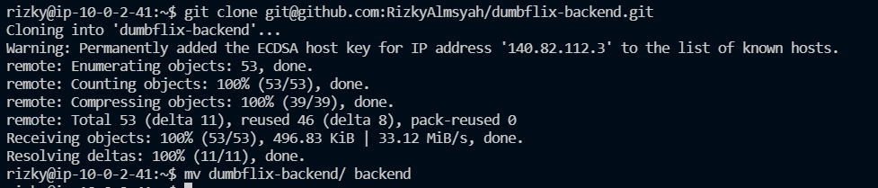
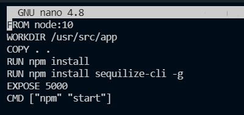
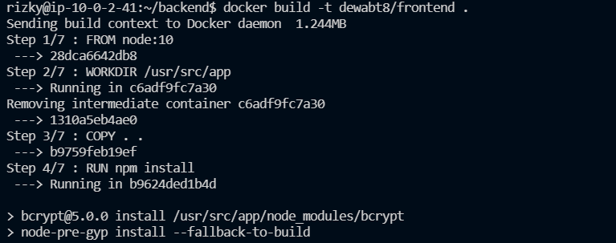
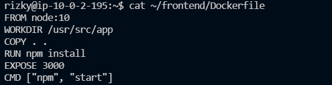
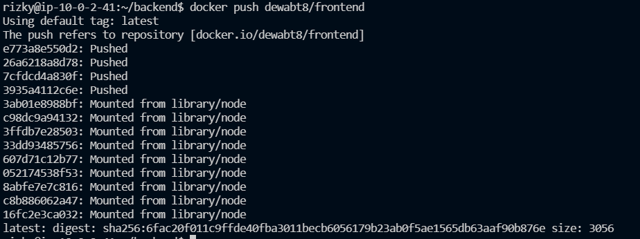
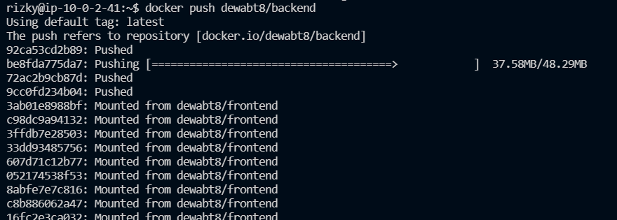
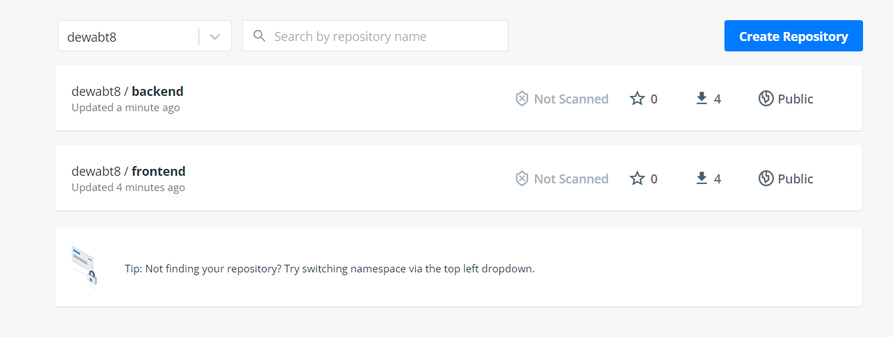

# Create Docker Image

1. masuk ke ec2-backend kemudian lakukan update & upgrade
2. Kemudian kita git clone dumbflix-backend
    
   
    
3. kemudian buat Dockerfile untuk backend
    
   
    
4. Kemudian kita build menjadi image
    
   
    
5. untuk frontend juga sama clode dari github kemudian buat dockerfile dan juga dibuild
    
   
    
6. Kemudian push image frontend & backend ke dockerhub
    
   
    
    
   
    
7. Hasilnya seperti berikut
    
   
    