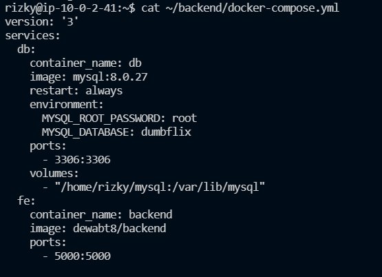
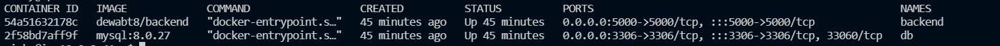
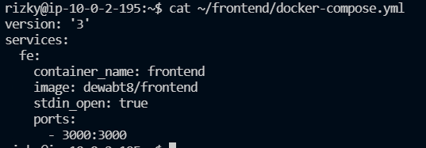
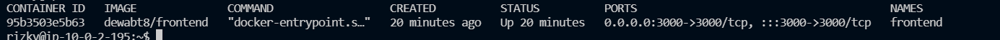
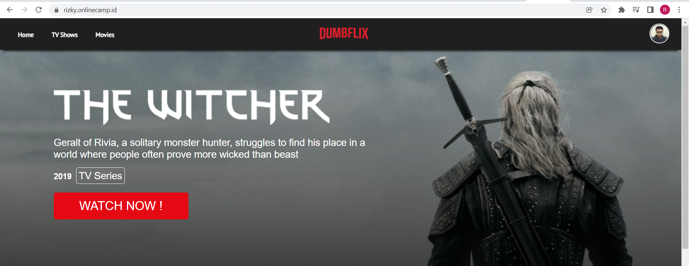

# Install Application

1. Untuk BE buat docker-compose
   
    
   
    
2. Kemudian `docker-compose up -d` dan hasilnya seperti ini
    
   
    
3. Untuk FE buat docker-compose
    
   
    
4. Kemdian `docker-compose up -d` dan hasilnya seperti ini
    
   
    
5. hasilnya seperti berikut ini
    
   
    
   
   