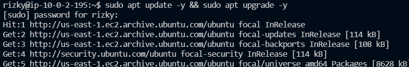
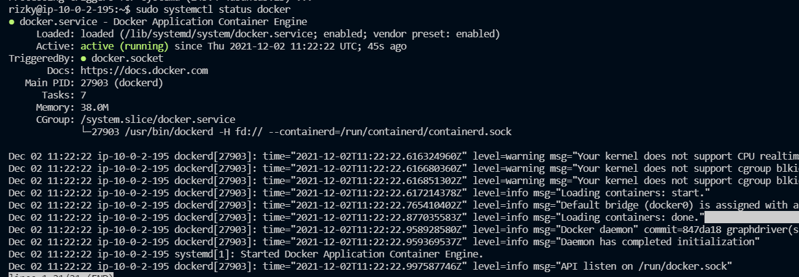

# Install Docker

1. Untuk pertama siapkan ec-2 untuk frontend
2. Kemudian update dulu sistemnya
   <br>
   
   <br>
3. Kemudian install docker
    ```
    sudo apt install apt-transport-https ca-certificates curl software-properties-common
    ```

    ```
    curl -fsSL https://download.docker.com/linux/ubuntu/gpg | sudo apt-key add -
    ```
    ```
    curl -fsSL https://download.docker.com/linux/ubuntu/gpg | sudo apt-key add -
    ```
    ```
    sudo apt update -y
    ```
    ```
    sudo apt install docker-ce -y
    ```
4. Hasilnya seperti berikut
   <br>
   
   <br>
5. Untuk backend juga sama lakukan seperti diatas
6. masuk docker login