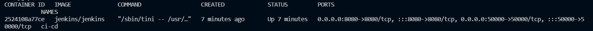
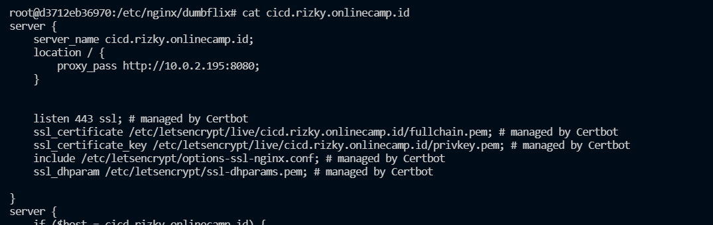
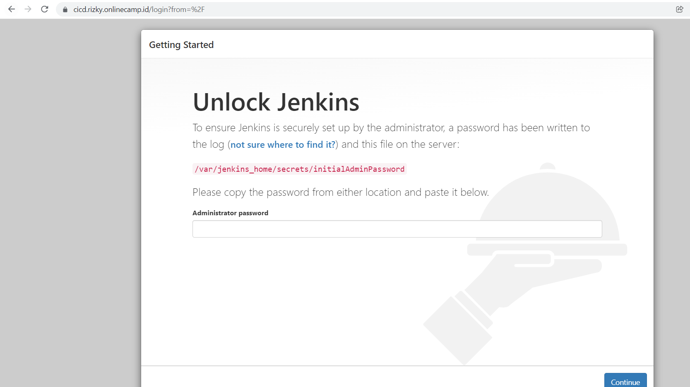
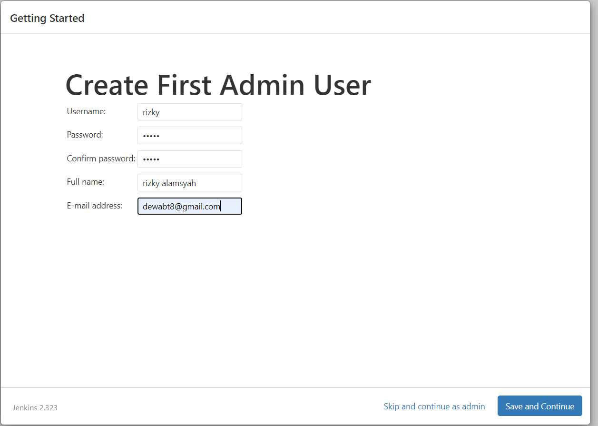
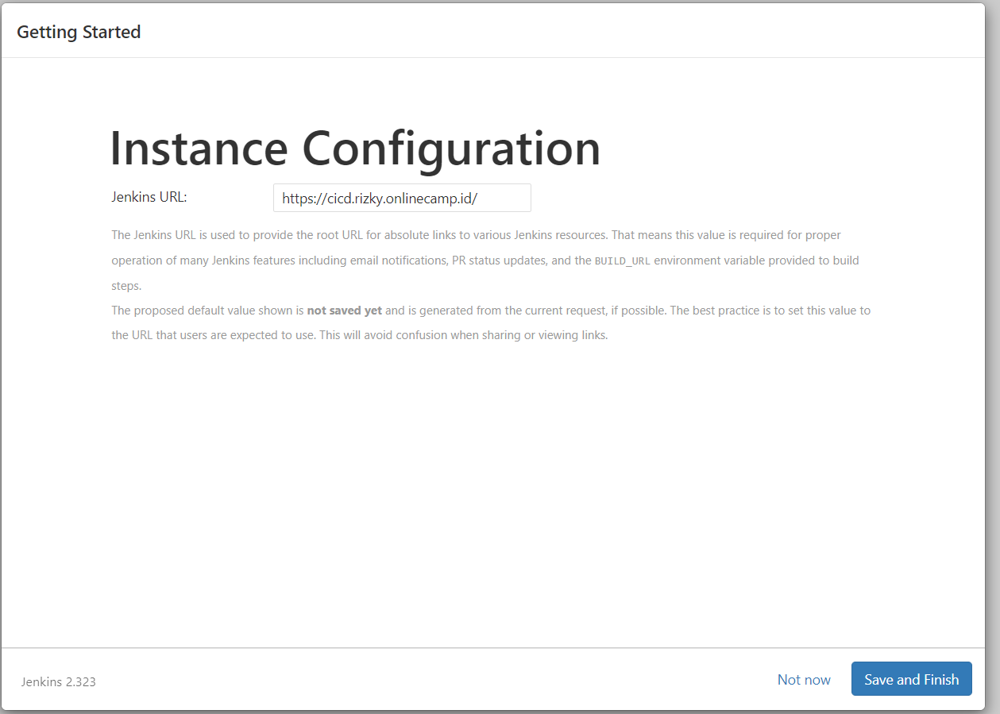
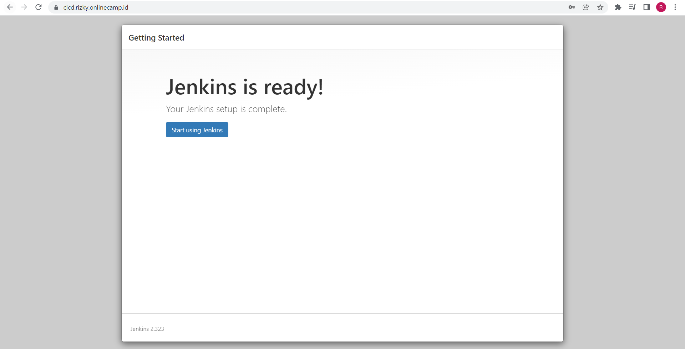

# Jenkins

1. Karena resource terbatas maka jenkin saya. saya masukkan ke frontend
2. Kemudian install jenkin dengan perintah berikut `docker run -u 0 --name cicd -p 8080:8080 -p 50000:50000 -d -v /home/rizky/jenkins_home:/var/jenkins_home jenkins/jenkins`
    
   
    
3. kemudian buat reverse-proxy
    
   
    
4. Kemudian akses `cicd.rizky.onlinecamp.id`
    
   
    
5. Kemudian buat user
    
   
    
6. lalu pilih url dan klik finish
    
   
    
7. jenkins siap digunakan
    
   
    
   