# Setup Jenkins

1. Tampilan jenkins pada saat masuk
    
   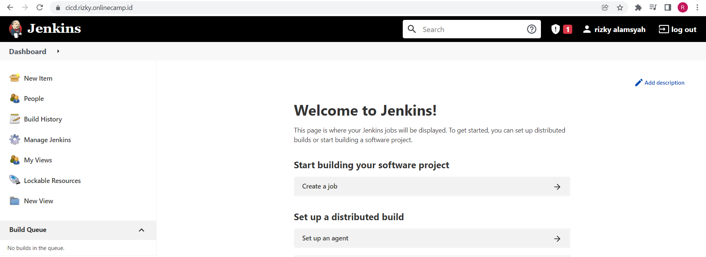
    
   
2. Lalu kita install Publish over ssh
    
   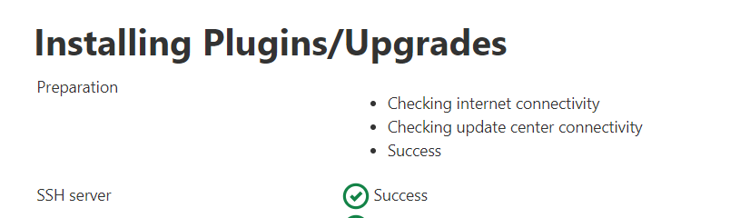
    
3. lalu kita pilih freestyle project
    
   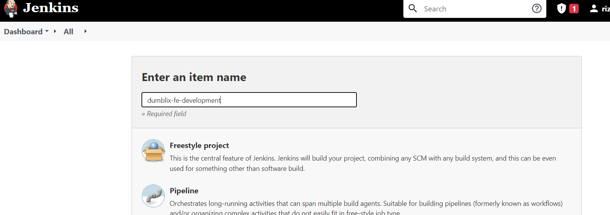
    
4. kemudian kita buat ssh server
    
   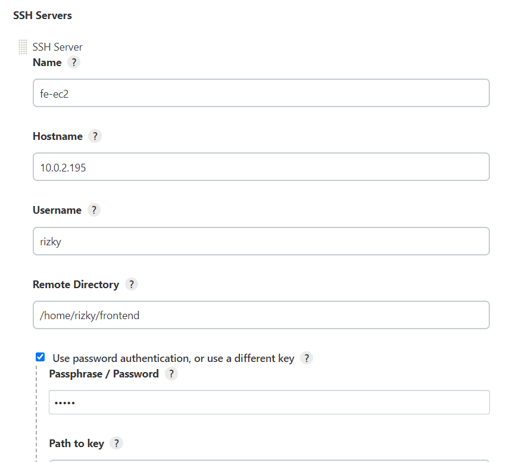
    
5. kemudian tambahkan seperti berikut
    
   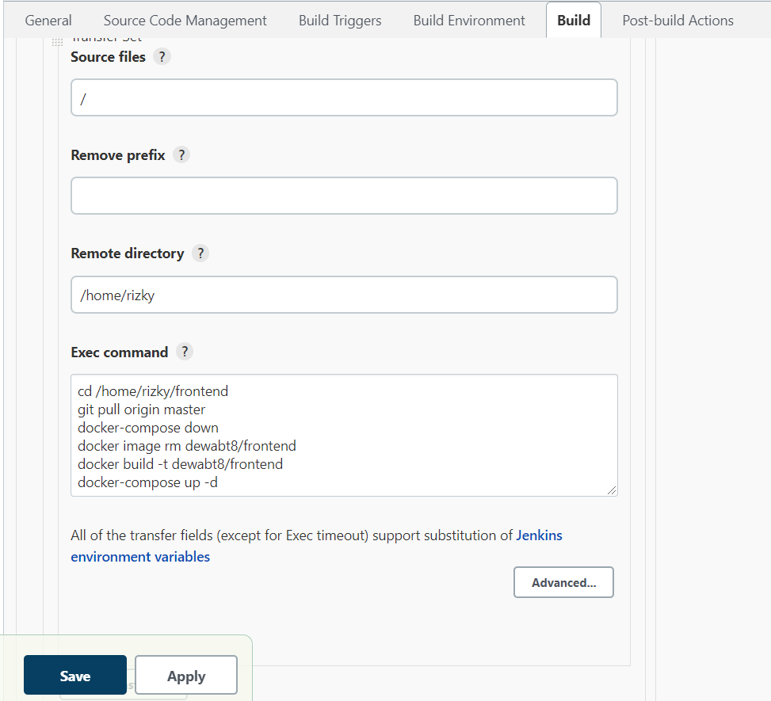
    
6. begitu juga seperti backend
    
   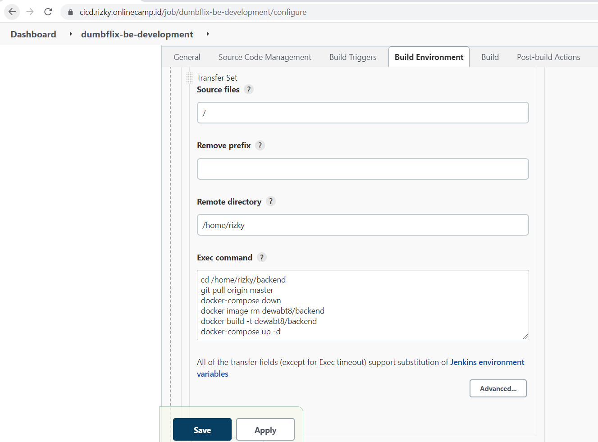
    
7. kemudian tambahkan webhooks digithub
    
   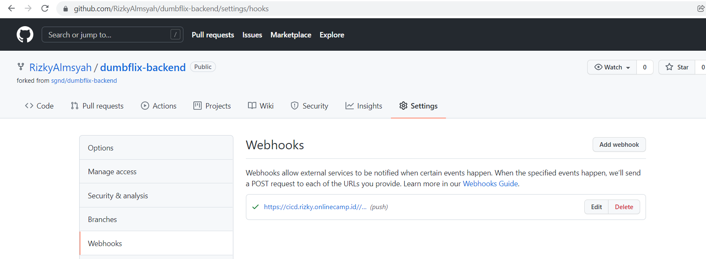
    
8. dan hasilnya seperti berikut dan apabila code dipush ke github
    
   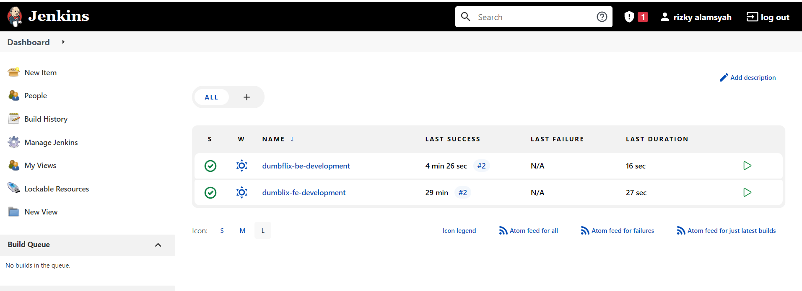
    
    
   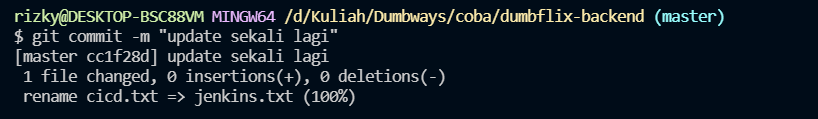
    
9.  hasilnya
     
   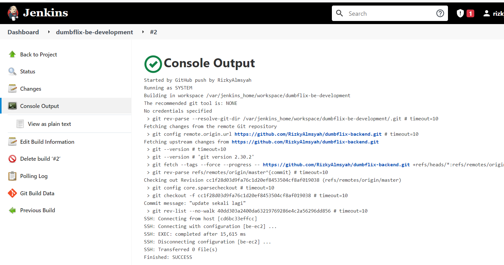
    
    
   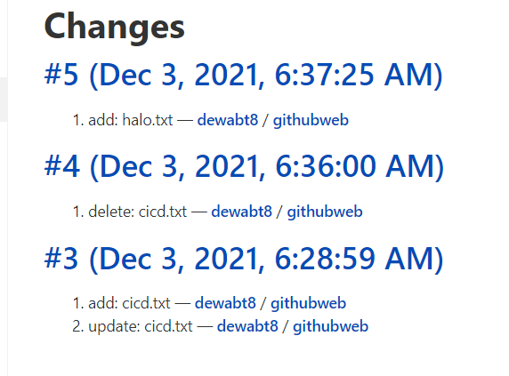
    
