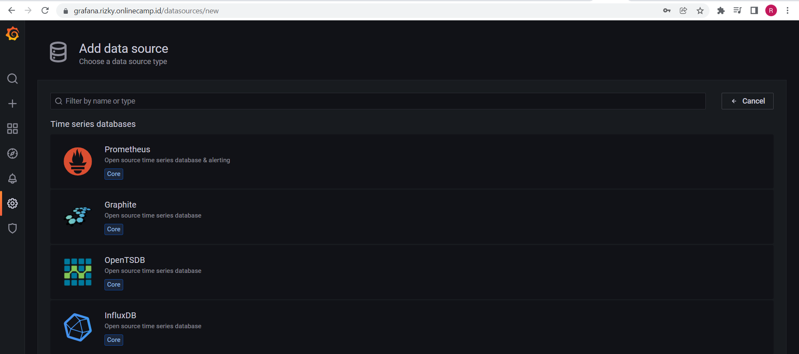
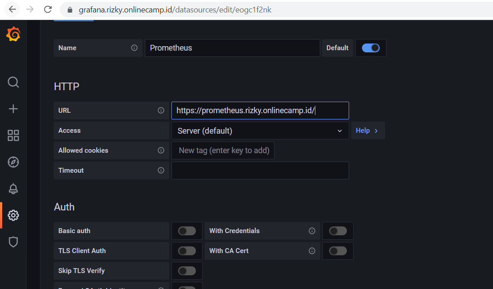
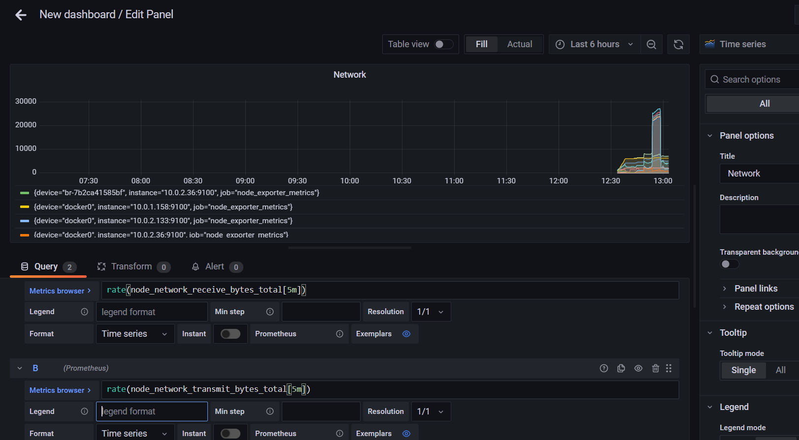
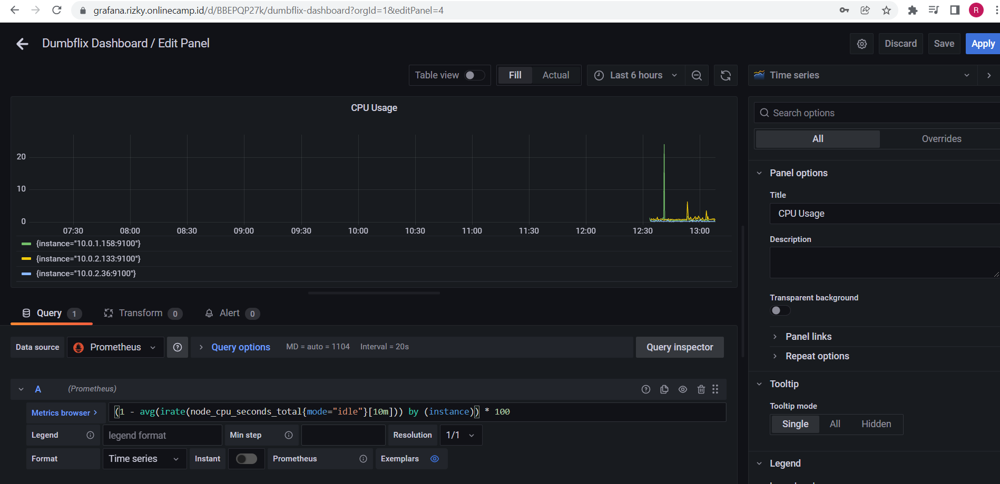
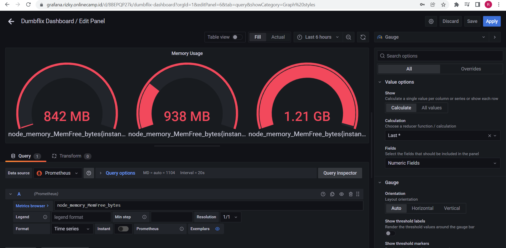
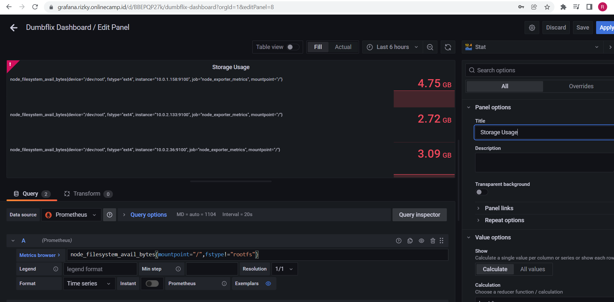
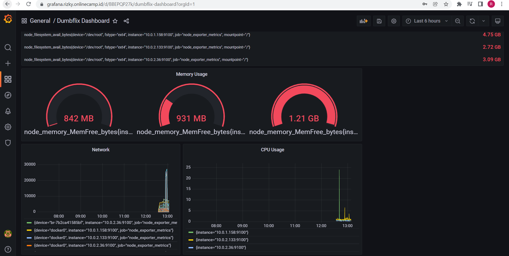

# CONNECT MULTIPLE SERVER TO PROMETHEUS

1. Pilih prometheus pada data source
   <br>
   
   <br>
2. Masukkan url prometheus kemudian save
   <br>
   
   <br>

# Dashboard

1. Add new panel kemudian edit
2. Pada bagian Query, cari metric
3. node_network_receive_bytes_total di kolom Metrics Browser
4. Tambahkan function rate() rate(node_network_receive_bytes_total[5m])
5. Add query baru, cari metric node_network_transmit_bytes_total di kolom Metrics Browser
6. Tambahkan function rate() rate(node_network_transmit_bytes_total[5m])
7. Kemudian pilih pada bagian panel option beri nama pada panel
8. Klik Apply
    <br>
   
   <br>
   <br>
# Buat Panel untuk CPU usage


1. Add new panel
2. Pada bagian Query, copy rumus berikut untuk menampilkan CPU usage

    ```
    (1 - avg(irate(node_cpu_seconds_total{mode="idle"}[10m])) by (instance)) * 100 
    ```

3. Setelah itu graph akan terupdate jika berhasil
4. Beri nama pada panel kemudian simpan.
<br>
   
   <br>
   <br>

# Buat panel untuk memory usage

1. Add new panel
2. Pada bagian Query, cari dan set Metric Browser `node_memory_MemFree_bytes`
3. Di bagian panel cari standard options. pilih unit bytes(SI)
4. Pilih graph type Gauge
   <br>
   
   <br>
   <br>

# Buat panel untuk storage

1. Add new panel
2. Pada bagian Query, cari dan set Metric Browser untuk menampilkan available storage `node_filesystem_avail_bytes{mountpoint="/",fstype!="rootfs"}`
3. Tambahkan query lagi untuk menampilkan size storage `node_filesystem_size_bytes{mountpoint="/",fstype!="rootfs"}`
4. Di bagian panel cari standard options. pilih unit bytes(SI)
5. Pilih graph type Stat
   <br>
   
   <br>
   <br>
   
   

Hasilnya seperti berikut

<br>
   
   <br>
   <br>