# Deploy PHP Application in CPanel

1. Pertama masuk ke https://byet.host/ dan buat akun
    
   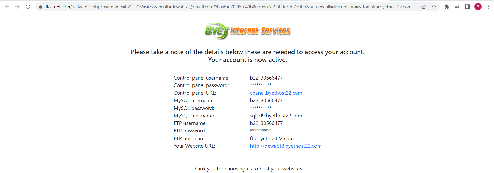
    
2. login `http://cpanel.byethost.com/`
    
   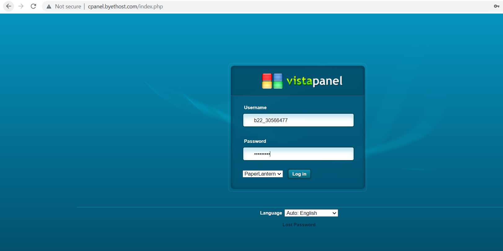
    
3. berikut merupakan tampilan cpanel
    
   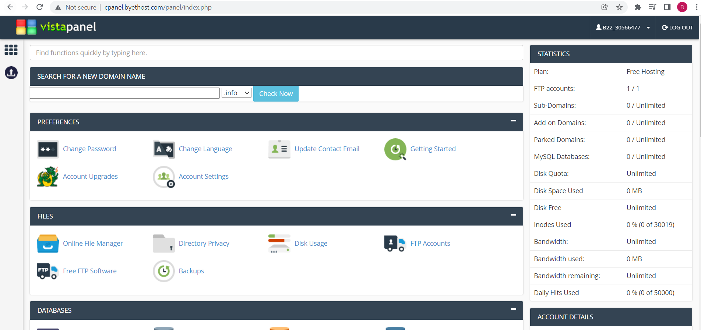
    
4. Proses pembuatan akun di byet host selesai.

Install phpBB dicpanel

1. masuk ke dashboard
    
   
    
2. Pada dashboard, pilih dan arahkan ke Suftaculous Apps Installer
    
   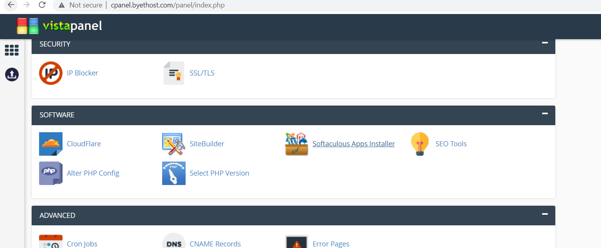
    
3. saat masuk ke dalam suftaculous Apps Installer, pilih phpBB
    
   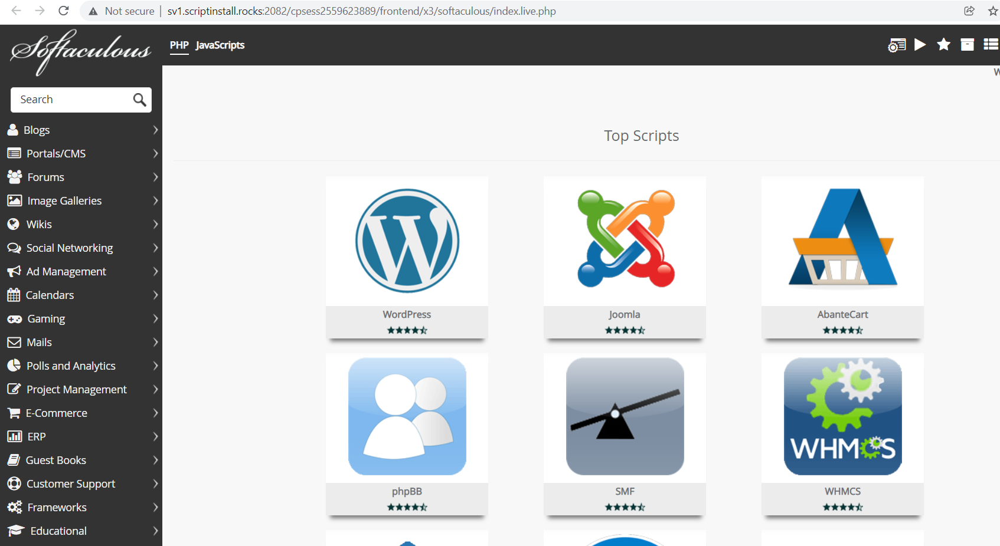
    
4. Klik install phpBB. Akan diarahkan ke halaman dashboard phpBB
    
   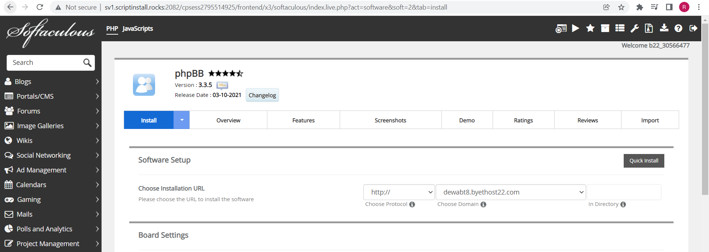
    
5. Kemudian hasilnya seperti ini
    
   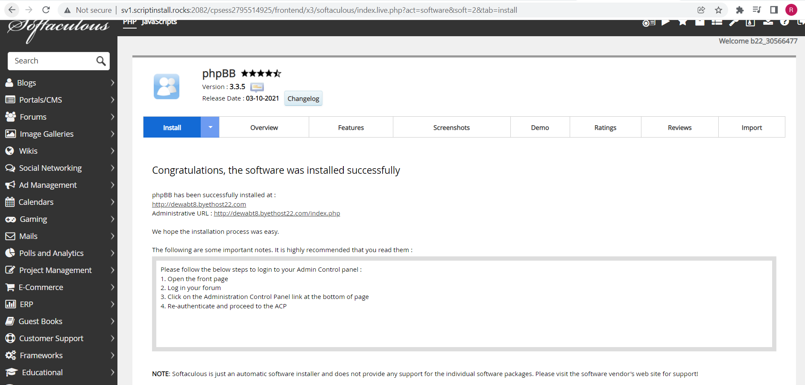
    
6. Arahkan URL ke tujuan yang sudah di setting sebelumnya pada saat installasi phpDB
    
   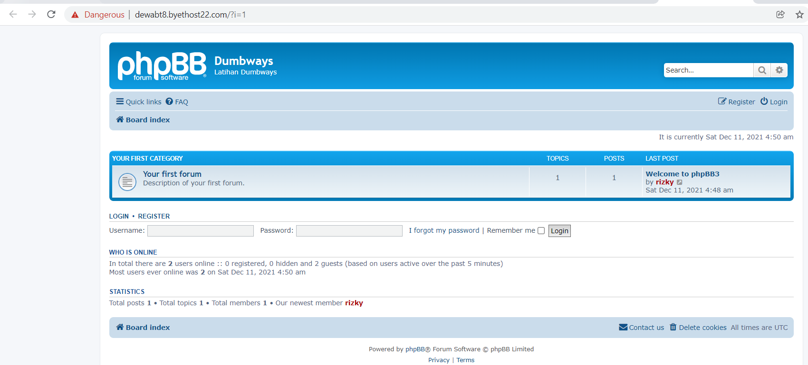
    
7. Cek apakah aplikasi sudah berjalan
    
   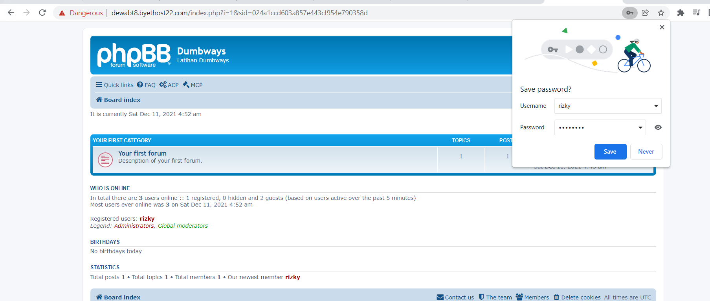
    

# Buat Database diCPanel

1. masuk ke Cpanel
2. Arahkan ke phpMyadmin
    
   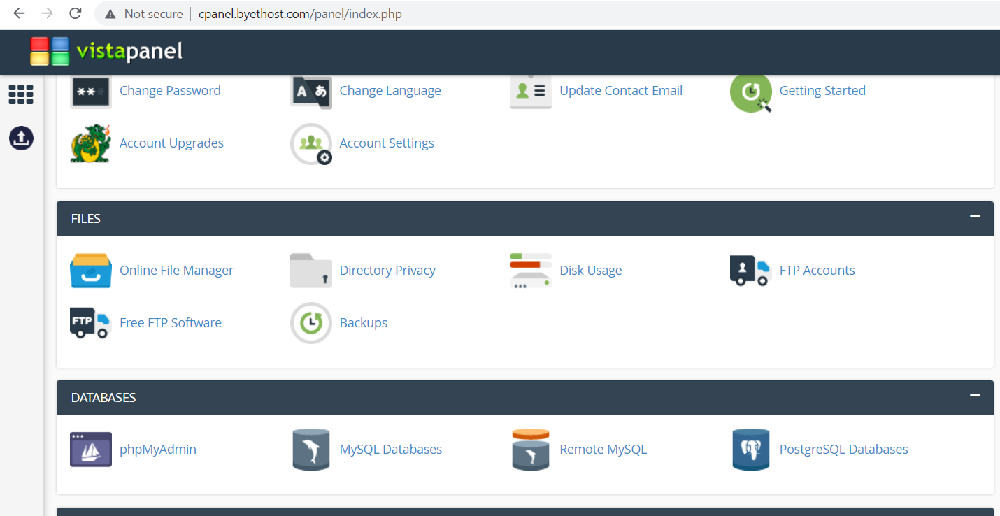
    
3. Saat installasi phpBB sebelumnya berjalan, ia akan menginstall plugin-plugin yang dibutuhkan dan juga otomatis membuat databasenya
    
   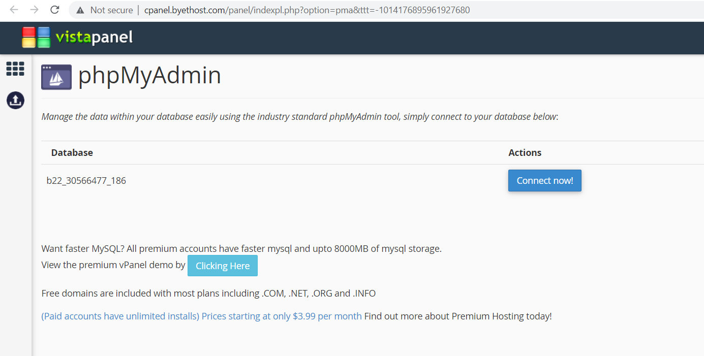
    
4. Connect ke database
5. Akan diarahkan ke database yang sudah dibuat di phpBB
6. Dan menampilkan isi tabel dari phpBB
    
   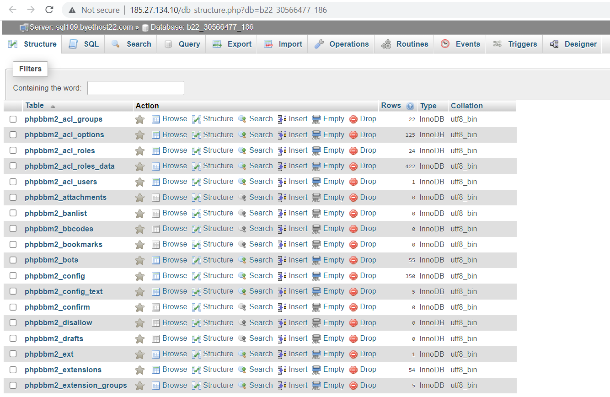
    
7. Proses selesai