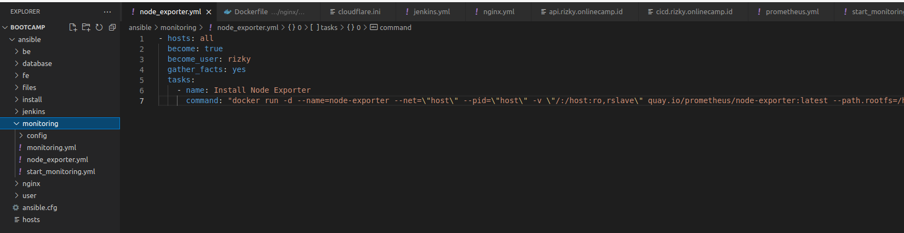
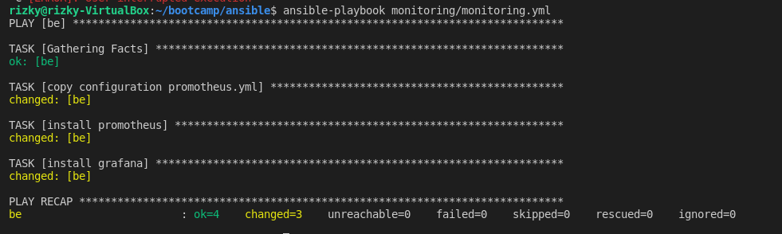
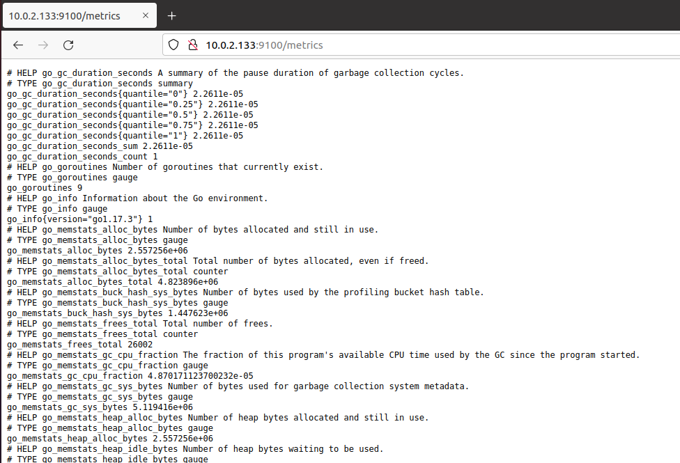
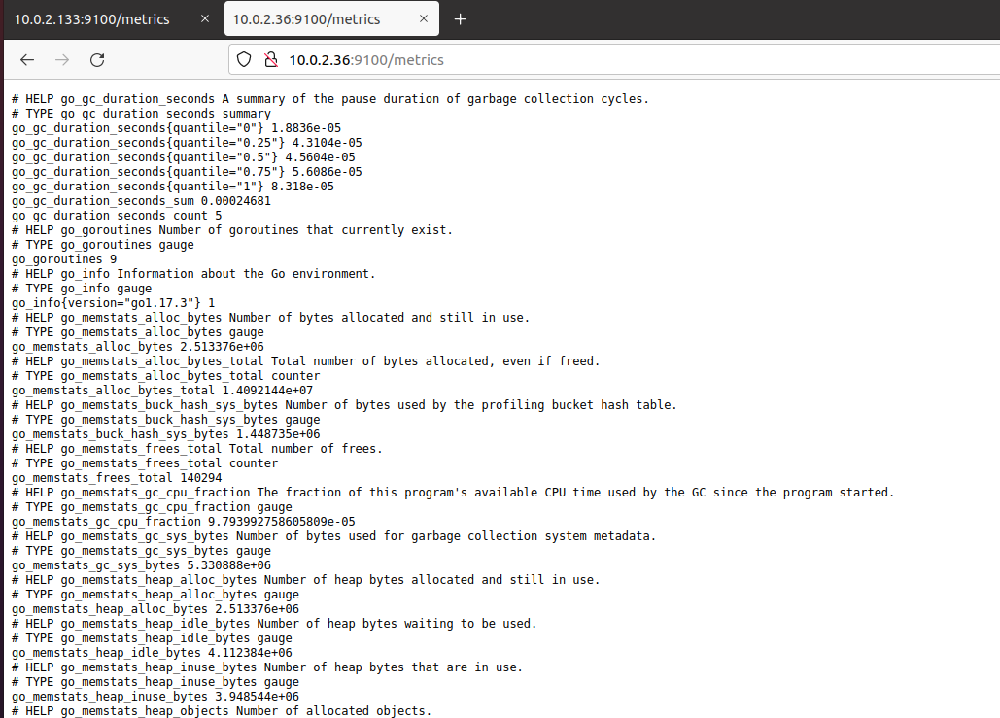
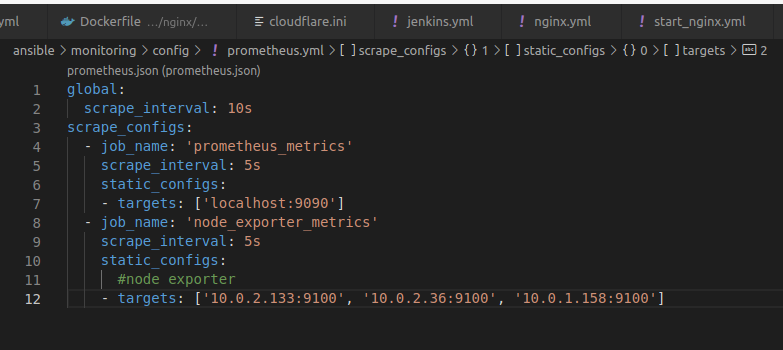
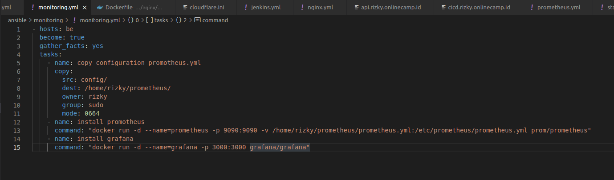
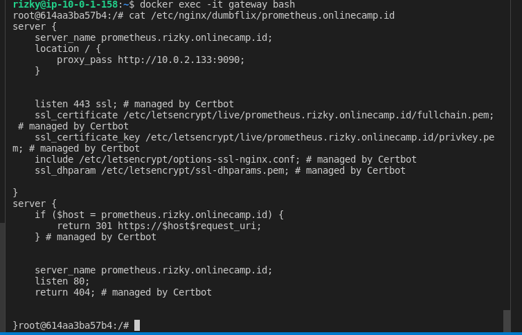
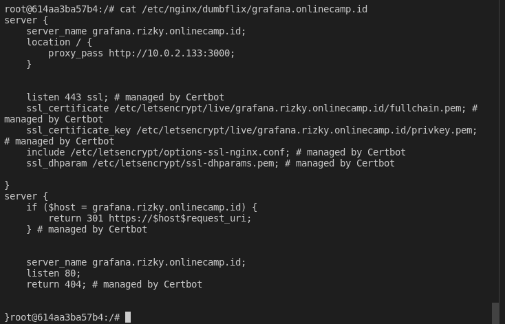
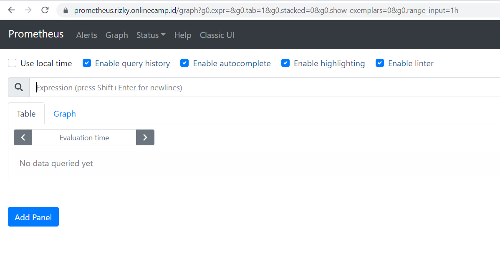
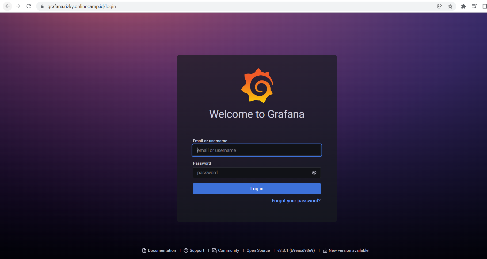

# Setup Monitoring with Promotheus

1. Pertama-tama siapkan install node-exporter tiap server disini saya menggunakkan ansible
2. untuk konfigurasi instalasi node-exporter seperti berikut
    
   
    
3. kemudian jalankan `ansible-playbook node_exporter.yml`
    
   
    
4. untuk hasilnya seperti ini
    
   
    
    
   
    
    
   
    

# Install grafana dan prometheus

1. Disini saya juga menggunakkan ansible
2. Untuk konfigurasi instalasi grafana dan promethus seperti ini
    
   
    
    
   
    
3. siapakan reverse-proxy untuk ansible dan grafana
    
   
    
    
   
    
4. Hasilnya seperti berikut
    
   
    
    
   
    