# Setup Server with Ansible

# install ansible
1. konfigurasi PPA
   ```
   sudo apt update
   sudo apt install software-properties-common
   sudo add-apt-repository --yes --update ppa:ansible/ansible
    ```
2. kemudian install apt ansible
<br>
   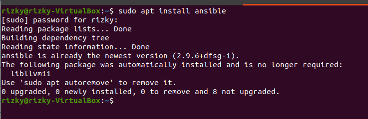
   <br>
    <br>

# Define host server

1. Buat directory ansible dan buat hosts untuk menyimpan konfigurasi host
<br>
   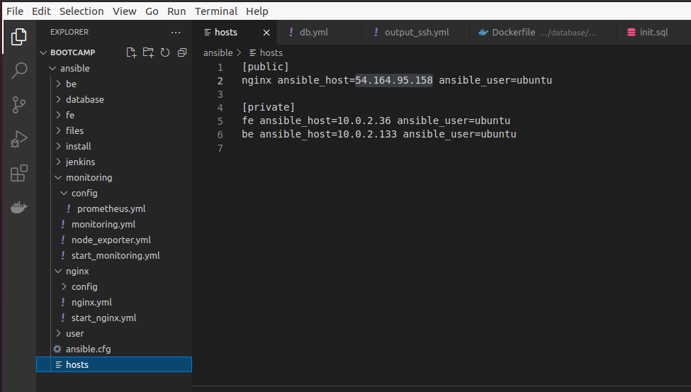
   <br>
   <br>
   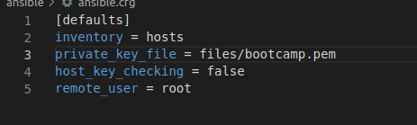
   <br>
2. kemudian cek ping
    <br>
   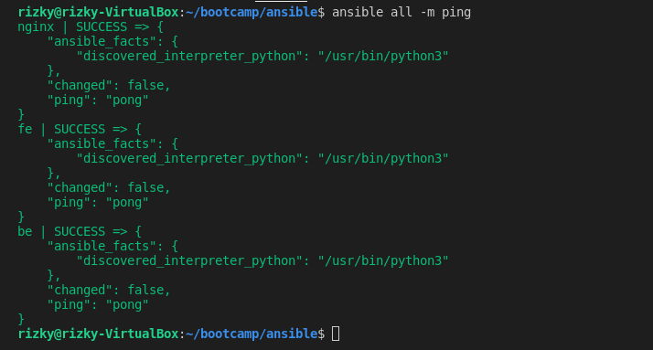
   <br>

# Setup User

1. Disini saya menggunakkan ansible-playbook
2. Siapkan konfigurasi untuk membuat user
    <br>
   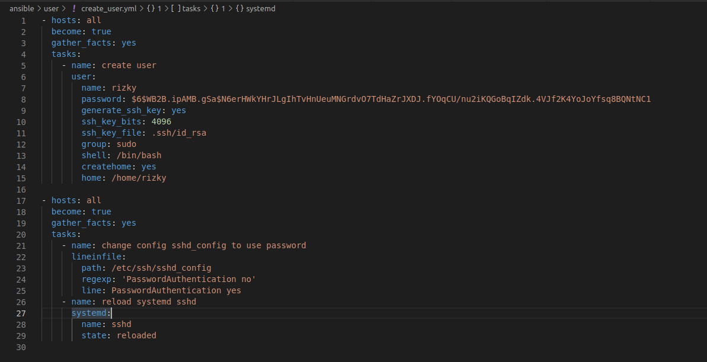
   <br>
3. Kemudian jalankan `ansible-playbook user.yml`
     <br>

# Setup Nginx
1. Siapkan konfigurasi untuk nginx dan kemudian jalankan `ansible-playbook nginx.yml`
    <br>
   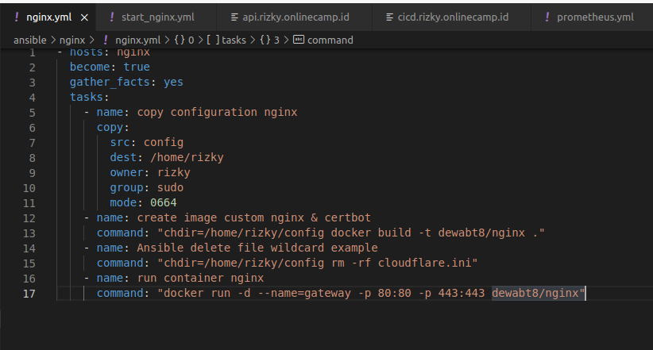
   <br>

# Setup CICD
1. Siapkan konfigurasi untuk jenkins dan kemudian jalankan `ansible-playbook jenkins.yml`

    <br>
   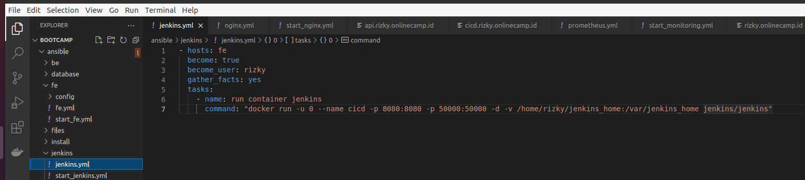
   <br>

# Setup Database


1. Siapkan konfigurasi untuk database dan kemudian jalankan `ansible-playbook db.yml`

    <br>
   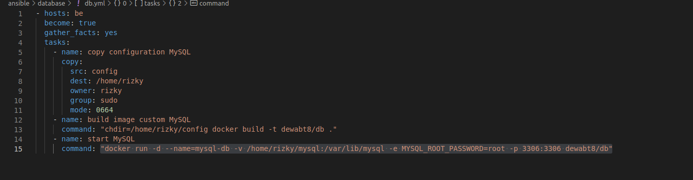
   <br>


# Setup Backend

1. siapkan konfigurasi untuk be dan kemudian jalankan `ansible-playbook be.yml`
    <br>
   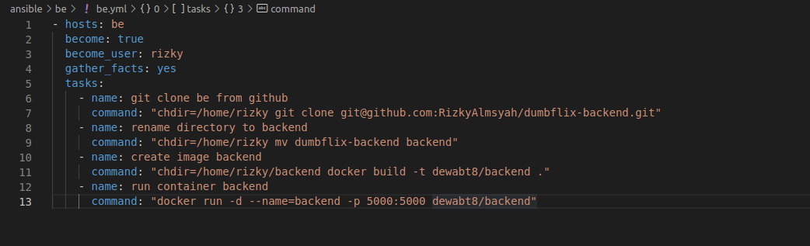
   <br>

# Setup Frontend

1. siapkan konfigurasi untuk be dan kemudian jalankan `ansible-playbook fe.yml`

    <br>
   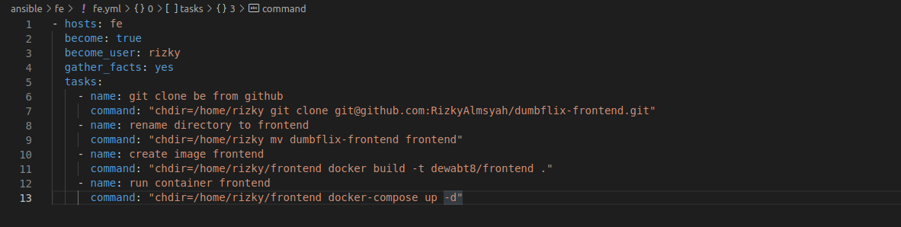
   <br>

Hasilnya seperti berikut

<br>
   
   <br>
    <br>
   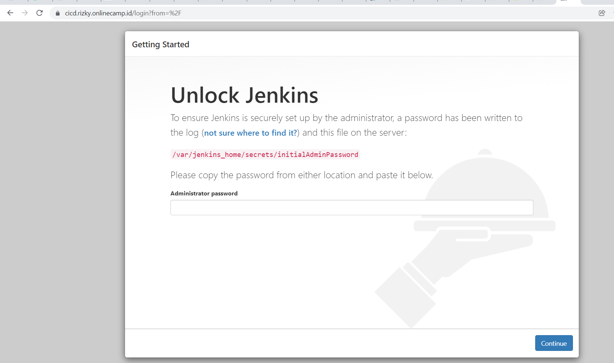
   <br>
    <br>
   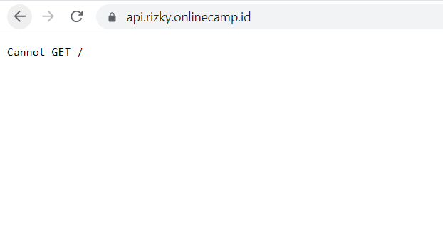
   <br>

